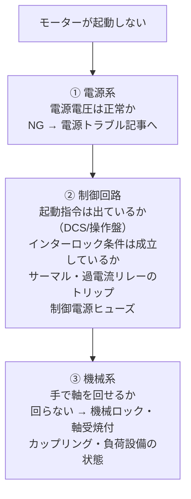

# モータートラブル

!!! danger "⚡ まず確認（3秒）"
    1. **サーマルリレー**がトリップしていないか → 現場盤を目視
    2. **電源電圧**（3相）は正常か → テスターで確認
    3. **インターロック**が解除されているか → DCS画面を確認

    🔇 異臭・煙・異音があれば即停止・退避。一人で触らない。

## 30秒まとめ

「起動しない・過熱する・振動・絶縁低下」の4パターンが大半。防爆エリアでの作業は事前のガス検知と防爆工具の使用が必須。

---

## 起動しない場合の切り分けフロー

電源系 → 制御回路 → 機械系 の順に切り分けます。上流が NG のまま下流を追っても原因にたどり着けません。

| 確認項目 | 確認方法 | 異常サイン |
|---------|---------|----------|
| 電源電圧（3相） | テスター | 相欠け・著しい電圧不均衡 |
| 制御電源 | テスター | 制御ヒューズ断 |
| インターロック | DCS 画面・ラダー | インターロック未解除 |
| サーマルリレー | 現場盤 | トリップ表示 |
| 絶縁抵抗 | メガー（低圧は 500V） | 低圧モーター：1MΩ 未満は要注意（実務管理値。正典は [絶縁管理](../05-hozen/insulation-management.md)） |

!!! tip "DCS インターロック確認の手順"
    DCS 画面でモーターが「起動禁止」状態になっている場合、
    インターロック条件（吸入側バルブ開・冷却水流量確認など）を1つずつ確認する。
    製造担当に「どのインターロックが成立していないか」を伝えることで連携が速くなる。

---

## 過電流・サーマルトリップ

### 主な原因と確認方法

| 原因 | 症状の特徴 | 確認方法 |
|------|----------|---------|
| 過負荷 | 負荷増加に伴い電流上昇 | 電流計・クランプメーター |
| 相欠け | 電流不均衡・うなり音 | 3相電流を個別に測定 |
| 電圧低下 | 全体的に電流増加 | 電源電圧測定 |
| 軸受劣化・ロック | 起動電流が下がらない | 空転で確認（負荷を切り離して試運転） |
| 巻線短絡 | 絶縁抵抗が極端に低い | メガー測定 |

!!! warning "サーマルリレーの整定値確認"
    サーマルリレーの整定電流値がモーターの定格電流に合っているか確認する。
    整定値が高すぎると保護機能が働かない。低すぎると頻繁にトリップする。
    整定値 = モーター定格電流 × **1.0〜1.1** が目安（実務慣行。電技解釈第153条は過負荷保護装置の施設を義務付けるのみで、動作電流の倍率の数値は条文に無い）。
    **定格を下回る整定にすると正常な全負荷運転中にトリップする**ため、0.9 倍などの設定はしない。詳細は [モーター制御](../02-teiatsu/motor-control.md) が正典。

---

## 振動・異音の切り分け

### 振動・異音の原因分類

| 症状 | 疑われる原因 | 確認方法 |
|------|-----------|---------|
| 低周波のうなり・振動 | 電磁的問題（電圧不均衡・相欠け） | 電流3相測定 |
| 高周波の金属音 | 軸受劣化・グリース不足 | 軸受温度・振動測定 |
| 起動時のみ振動 | カップリングアンバランス・ミスアライメント | カップリング確認 |
| 特定回転数で共振 | 固有振動数との共鳴 | 回転数を変えて確認（インバータ制御の場合） |
| 不規則な衝撃音 | 異物混入・インペラ損傷 | 分解点検 |
| キャビテーション音（ポンプ） | 吸入側圧力不足 | 吸入圧力・液面確認 |

!!! tip "軸受劣化の早期発見"
    軸受温度が周囲温度 +40℃ 以上になっていたら劣化の可能性がある（経験則の目安）。
    振動測定値（速度実効値）は 4.5mm/s を超えたら要注意、7.1mm/s を超えたら早急に対応する。
    いずれも実務目安であって規格値ではない（振動判定表と、規格番号で権威づけしない扱いの経緯は
    [データ活用・予兆保全](../05-hozen/predictive-maintenance.md) が正典。実際の判定値はメーカー推奨値・社内基準による）。

---

## 絶縁抵抗低下

### 判定基準（低圧モーター・実務管理値）

| 測定結果 | 判定 | 対応 |
|---------|------|------|
| 1MΩ 以上（新品は 5〜10MΩ） | 良好 | 定期点検を継続 |
| 0.5〜1MΩ | 要注意 | 原因調査・早期対応 |
| 0.5MΩ 未満 | 危険 | 使用停止・点検修理 |

※ 判定値は経験的な実務管理値で法定値ではない（正典は [絶縁管理](../05-hozen/insulation-management.md)。電技省令第58条の 0.1／0.2／0.4 MΩ は**低圧電路**の下限で、これとは別物）。
※ 測定は 500V メガー使用（低圧モーター）。高圧モーターは 5000V メガーで測定し、トレンド管理と PI 値で判定する（印加電圧の統一基準は [耐圧試験・絶縁診断](../01-koatsu/insulation-test.md)）。

### 絶縁低下の主な原因

- **水分侵入**：グランドパッキン劣化・雨水浸入・洗浄水侵入
- **経年劣化**：絶縁材の熱劣化・化学物質による侵食
- **巻線汚染**：油・ダスト・腐食性ガスの付着

!!! tip "乾燥処理で回復する場合がある"
    水分侵入による絶縁低下は、乾燥炉での加熱乾燥（約 80〜100℃ で 8〜24 時間）で
    回復するケースがある。ただし、乾燥処理後に再測定して確認すること。

---

## 相欠け運転の見分け方

相欠けは気づきにくく、モーターに深刻なダメージを与える。

**見分けるポイント：**
- 3相の電流値に著しい不均衡（電源側で1相が欠けると、欠相した相の線電流はほぼゼロになり、残り2相の電流が増大する）
- 低音のうなり音（正常時より重く、脈動する音）
- 運転は続くが出力が落ちている（負荷を引けていない）
- 巻線温度が異常に高い

!!! danger "相欠け運転を放置すると焼損する"
    相欠け状態でモーターを運転し続けると短時間で巻線が焼損する。
    電流不均衡が確認されたら即停止して原因（ヒューズ断・接触不良・MCCB 片相動作）を調査する。

---

## 防爆エリアでのモーター作業注意点

!!! danger "防爆エリアでの電気作業は特別な注意が必要"

- **作業前にガス検知を実施**（例：可燃性ガス濃度が爆発下限界〔LEL〕の 25% 未満。この数値は広く使われる管理値の例であり法定の統一値ではない。事業所の作業許可基準による）
- **防爆対応工具を使用**（鉄製工具の打撃は火花の原因になる）
- **防爆性能を損なう改造・修理は行わない**（危険箇所では防爆性能を有する電気機械器具でなければ使用できない＝労働安全衛生規則第280条第1項。条文の逐語照合は [防爆](../03-keiso/explosion-proof.md) の根拠節が正典）
- **モーター交換時は防爆仕様の確認**（耐圧防爆・内圧防爆・安全増防爆の種別を確認）
- **端子箱の開放は通電状態で行わない**

!!! warning "防爆モーターの修理"
    防爆モーターを修理・改造する場合は、修理後の防爆性能を確認する必要がある。
    構造を変更する修理は防爆検定証書が失効する場合があるためメーカーに確認すること。

---

## 原因候補の確率表（経験則）

| 症状 | 第1候補（最多） | 第2候補 | 第3候補 |
|------|--------------|-------|-------|
| 起動しない | インターロック未成立 | サーマルトリップ | 制御ヒューズ断 |
| サーマルトリップ | 過負荷（負荷増） | 相欠け | 整定値不適切 |
| 振動増大 | 軸受劣化 | アンバランス | ミスアライメント |
| 絶縁低下 | 水分侵入 | 経年劣化 | 巻線汚染 |
| 異音 | 軸受グリース不足 | 異物混入 | ファン破損 |

---

## 根拠

### 本ページが正典の範囲

**現場でのモータートラブルの切り分け手順**（起動不良・過電流・振動・絶縁低下・相欠けの症状別フロー）が本ページの正典範囲です。サーマルリレー整定の考え方は [モーター制御](../02-teiatsu/motor-control.md)、絶縁抵抗の印加電圧・法定値・実務管理値は [絶縁管理](../05-hozen/insulation-management.md)、振動・軸受の判定表は [データ活用・予兆保全](../05-hozen/predictive-maintenance.md)、防爆の法的要求は [防爆](../03-keiso/explosion-proof.md) が正典で、本ページは数値を再記述しません。

### 是正の記録（2026-08-05）

- **高圧モーターのメガー印加電圧**: 「1000V メガー」と記載していましたが、本 Wiki の統一基準（[耐圧試験・絶縁診断](../01-koatsu/insulation-test.md)：高圧モーター＝5000V メガー・PI 値・トレンド管理）とのページ間不一致のため **5000V** に是正しました
- **絶縁抵抗の判定表**: 「100MΩ 以上＝良好／10〜100MΩ＝注意／1〜10MΩ＝要注意／1MΩ 未満＝不良／0.1MΩ 未満＝危険」という出所不明の5段表を載せていましたが、正典（[絶縁管理](../05-hozen/insulation-management.md)：低圧電動機は 1MΩ 以上＝良好〔新品 5〜10MΩ〕・0.5〜1MΩ＝要注意・0.5MΩ 未満＝危険）と食い違っていたため、正典の実務管理値に揃えました
- **相欠けの見分け方**: 「一相が他の2倍以上」という不正確な表現を、機序に沿って「電源側欠相では欠相相の線電流はほぼゼロ・残り2相が増大」に是正しました
- **ガス検知の 25% LEL**: 要求値のように書いていましたが、法定の統一値ではなく管理値の例である旨を明示しました

### 実務慣行（規格・法令の裏付けなし）

- **サーマル整定 1.0〜1.1 倍**: 実務慣行の目安。電技解釈第153条は過負荷保護装置の施設を義務付けるのみで倍率の数値は条文に無い（条文照合と経緯は [モーター制御](../02-teiatsu/motor-control.md) の根拠節が正典）
- **軸受温度「周囲 +40℃」・振動 4.5／7.1 mm/s**: 経験的な目安。ISO 規格値としては引用しません（経緯は [データ活用・予兆保全](../05-hozen/predictive-maintenance.md) の根拠節）
- **乾燥処理 80〜100℃・8〜24 時間**、**ガス検知 25% LEL**、**原因候補の確率表**: いずれも経験則・社内慣行の域で、規格・法令の裏付けはありません

### 原本未照合（honest-hold）

- **振動判定の ISO 10816／20816 系規格**は有償で原本未照合です。本ページの 4.5／7.1 mm/s を規格値として扱わないでください
- **モーター巻線の絶縁診断規格**（IEEE Std 43 等）も原本未照合です（[絶縁管理](../05-hozen/insulation-management.md) の根拠節と同じ扱い）

### 限界の明示

- 判定値（絶縁・振動・温度）はいずれも**メーカー推奨値・社内基準が優先**です。本ページの数値だけで使用可否を確定しないでください
- 防爆エリアの作業要件（ガス検知の管理値・工具・手順）は**事業所の作業許可基準が正**です

### 正典参照

| 項目 | 正典 |
|---|---|
| サーマルリレー整定（1.0〜1.1 倍の位置づけ・条文照合） | [モーター制御](../02-teiatsu/motor-control.md) |
| 絶縁抵抗の印加電圧・法定値（省令第58条）・実務管理値 | [絶縁管理](../05-hozen/insulation-management.md) |
| メガー印加電圧の統一基準・PI 値 | [耐圧試験・絶縁診断](../01-koatsu/insulation-test.md) |
| 振動・劣化予兆の判定表 | [データ活用・予兆保全](../05-hozen/predictive-maintenance.md) |
| 防爆の使用義務（安衛則第280条・解釈第176条）・構造種別 | [防爆](../03-keiso/explosion-proof.md) |
| 保護継電器の誤動作・不動作の切り分け | [保護継電器トラブル](protection.md) |

照合日: 2026-08-05（法令・規格は新規照合せず、逐語照合済みの正典ページへの参照に整理。判定表2件のページ間不一致を是正）。

## 関連ページ

- [モーター制御](../02-teiatsu/motor-control.md) — 自己保持・インターロックの回路側の理解
- [電源トラブル](power.md) — 電源系が原因と切り分かった場合
- [インバータトラブル](inverter.md) — インバータ駆動の場合
- [高圧モーター](../01-koatsu/hv-motor.md) — 高圧機の始動方式・保護
- [症状逆引きインデックス](index.md) — 他の症状から探す
