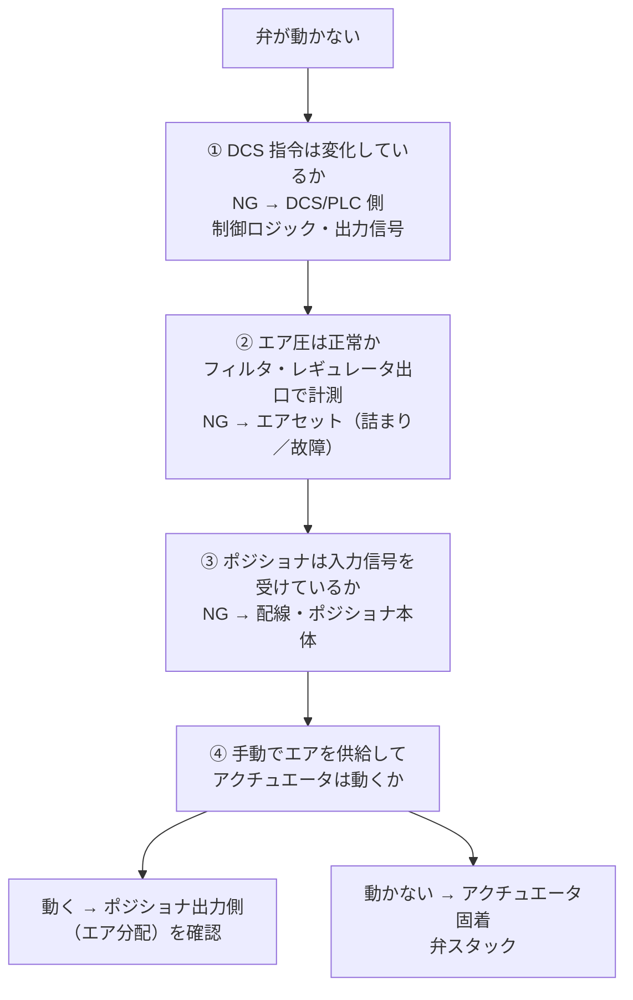

# 制御弁トラブル

## 30秒まとめ

制御弁トラブルは「エア圧 → ポジショナ → アクチュエータ → 弁本体」の順に確認。フェールポジション（FC/FO）を理解してから緊急時の手動操作を行う。

---

## 全開 / 全閉固着の切り分け

弁が動かない場合、「電気系・エア系・機械系」のどこで止まっているかを確認する。

### 確認ポイント早見表

| 確認箇所 | 確認方法 | 正常値 |
|---------|---------|-------|
| エア供給圧 | 圧力計 | 設計値（通常 0.4〜0.7 MPa） |
| ポジショナ入力信号 | テスター（電流計） | 4〜20 mA |
| ポジショナ出力圧 | 圧力計 | 指令に応じて変化 |
| アクチュエータ作動 | 手動でエア給排気 | 正常に動く |

---

## 指令値と開度の不一致

DCS の指令が 50% なのに弁が 30% や 70% にしかならない場合。

### ポジショナ調整の確認

1. **ポジショナのゼロ・スパン調整がずれていないか**
   - ゼロ点：4mA 入力時に弁が 0% になるか
   - スパン：20mA 入力時に弁が 100% になるか

2. **フィードバック機構の確認**
   - 弁開度をポジショナに伝えるフィードバックリンクが外れていないか
   - リンクのガタ・摩耗

3. **ポジショナ内部の詰まり**
   - ノズル・フラッパ機構の詰まり（ゴミ・水分）

!!! tip "デジタルポジショナ（HART 対応）の場合"
    HART ハンドヘルドターミナルを使用してポジショナの診断機能を活用する。
    内部の自己診断データで「ゼロ・スパンのずれ量」「摩擦力」を数値で確認できる。

---

## リーク（シート漏れ・パッキン漏れ）

### シート漏れの判定

弁が全閉指令（0%）の状態で、下流側へ流体が漏れる場合：

- **漏れ量の確認**：弁下流の圧力・流量が完全にゼロにならない
- **原因**：シート損傷・異物噛み込み・弁体摩耗・腐食

| 漏れクラス | 許容シート漏れ量 | 対応するシート |
|------------|-------------|------|
| クラスIV | 定格容量の 0.01 % | メタルシートの標準クラス |
| クラスV | 水 0.0005 mL/min × 口径（インチ）× 差圧（psi） | メタルシートの最上位クラス（高差圧用） |
| クラスVI | 空気・窒素による気泡試験（許容気泡数は口径ごとに規定）。実質バブルタイト | ソフトシート弁 |

漏れクラスの定義は ANSI/FCI 70-2（対応国際規格 IEC 60534-4）によります。いずれも有償規格で**原本は未照合**です（複数の二次資料で一致確認。下記「根拠」参照）。

### パッキン漏れの確認

弁スタフィングボックス（グランド部）からの外部漏れ：
- 目視で液体・蒸気の漏れを確認
- **危険物・高圧ガスの場合は即時報告**。高圧ガスで災害が発生したときは高圧ガス保安法第63条第1項の事故届（遅滞なく都道府県知事又は警察官へ）の対象になるため、届出要否の判断も含めて保安担当へ直ちに連絡する（下記「根拠」参照）

!!! danger "腐食性流体・高圧ガスのパッキン漏れ"
    腐食性流体や高圧ガスのパッキン漏れは重大な安全リスク。
    製造担当に即報し、緊急バイパスへの切替または緊急停止を判断すること。

---

## ハンチング（制御弁がハンターする）

弁が指令値付近でガタガタと振動する現象。

### 原因の切り分け

| 原因 | 確認方法 | 対策 |
|------|---------|------|
| PID パラメータ不適切（P が大きすぎる） | DCS 側の PID 定数を確認 | 比例ゲインを下げる |
| ポジショナの感度が高すぎる | ポジショナのデッドバンド設定を確認 | デッドバンドを広げる |
| フリクション（スティックスリップ） | 弁をゆっくり動かして引っかかりを確認 | グランドパッキン調整・弁体交換 |
| 流体の圧力変動 | 上流側の圧力トレンドを確認 | 上流側の圧力安定化 |

!!! tip "ハンチングの一時的な対策"
    ポジショナのデッドバンド設定を広げることでハンチングを止められることがある。
    ただしこれは対症療法。根本原因（PID チューニング・弁の摩擦）を別途対処すること。

---

## エアセット圧力異常

制御弁のエア供給系（フィルタ・レギュレータ）のトラブル。

| 症状 | 疑われる原因 | 確認・対処 |
|-----|-----------|----------|
| エア圧が低い | フィルタ詰まり・供給元の圧力低下 | フィルタエレメント確認・清掃 |
| エア圧が不安定（変動） | レギュレータ劣化 | レギュレータ分解点検・交換 |
| エアが全く来ない | 供給配管詰まり・バルブ閉め忘れ | 供給ラインを上流から確認 |
| エア漏れ音がする | 配管接続部・アクチュエータシール劣化 | 漏れ箇所を石鹸水等で特定 |

供給元（コンプレッサ・ドライヤ・ヘッダ）側の系統構成と空気品質のトラブルは [計装空気](../03-keiso/instrument-air.md) を参照してください。

---

## 緊急時の手動操作

!!! warning "手動操作の前に製造担当・運転員に連絡すること"
    弁の手動操作はプロセスに直接影響する。
    「これから手動操作します」と連絡してから操作すること。

### ハンドホイールによる手動操作

多くの制御弁にはハンドホイール（手動操作用ハンドル）が付いている：

1. 自動/手動切替機構を「手動」に切り替える
2. ハンドホイールを回して弁を操作
3. 制御盤（DCS）で手動操作をロックしておく（自動運転に切り替わらないように）

### バイパス弁の操作

弁に並列にバイパス弁が設置されている場合：

1. 制御弁を全閉にする
2. バイパス弁をゆっくり開けてプロセスを調整
3. 制御弁の修理完了後、バイパスを閉め制御弁に切り替える

---

## フェールポジション（FC/FO）の確認

!!! danger "フェールポジションを誤解すると緊急時に重大事故になる"
    停電・エア喪失時に弁がどちらに動くかは、プロセス安全設計で決まっている。

| フェールポジション | 意味 | 使用例 |
|----------------|------|-------|
| FC（Fail Close） | 停電・エア喪失時に**全閉** | 危険物の流入を止める弁（緊急遮断弁） |
| FO（Fail Open） | 停電・エア喪失時に**全開** | 冷却水供給弁（止まると過熱する） |
| FL（Fail Lock） | 停電・エア喪失時に**現状維持** | ポジション保持が必要な弁 |

**停電や計画的な電気作業を行う前に、制御弁のフェールポジションを確認する。**
FC 弁が停電で全閉になると、プロセス停止や連鎖停止を引き起こす場合がある。
製造担当と事前に打ち合わせて、停電時のプロセス対応手順を確認しておくこと。

---

## 根拠

### 法令（一次照合済み）

- **高圧ガスの事故届**: 高圧ガス保安法（昭和26年法律第204号）**第63条第1項**「第一種製造者、第二種製造者、販売業者……その他高圧ガス又は容器を取り扱う者は、次に掲げる場合は、遅滞なく、その旨を都道府県知事又は警察官に届け出なければならない。一 その所有し、又は占有する高圧ガスについて災害が発生したとき。……」（e-Gov 現行条文で 2026-08-01 に逐語照合）。パッキン漏れ等の漏えいが同号の「災害」に当たるかの判断基準（事故の区分・通達運用）は本ページでは照合していないため、**現場は要否判断をせず、保安担当への即時連絡までを初動**とします。なお高圧ガス設備の変更工事の手続き（第一種＝変更許可・第二種＝事前届出）の正典は [規格・法規](../04-sekkei/standards.md)、電気事業法系の事故報告（電気関係報告規則第3条）の正典は [事故対応](../09-hoantokei/jiko-taiou.md) です。

### 規格（原本未照合・二次資料照合）

- **シート漏れクラス**: ANSI/FCI 70-2（対応国際規格 IEC 60534-4）。いずれも有償規格で**原本は未照合**ですが、クラスIV＝定格容量の 0.01 %、クラスV＝水 0.0005 mL/min×口径（インチ）×差圧（psi）、クラスVI＝空気・窒素の気泡試験（口径ごとの許容気泡数、ソフトシート）という区分は複数の独立した二次資料（バルブメーカー技術資料）で一致することを 2026-08-01 に確認しました。
- **是正の記録**: かつて本ページはクラスVIを「定格容量の 0.0005 % 以下」と記載していましたが、これは**クラスVの係数 0.0005（mL/min・単位も別物）との混同**で、クラスVIは容量比ではなく気泡試験で定義されるため 2026-08-01 に是正しました。CI の lint（`20260801-class6-teikaku-0005pct`）が再発を防ぎます。
- **試験条件は転記しない**: 漏れクラスの試験差圧・媒体・温度条件は原本未照合のため本ページには記載しません。受入試験・出荷試験の合否判定には規格原本またはメーカー試験成績書を使ってください。

### 数値の区分（実務値・正典参照）

- **エア供給圧 0.4〜0.7 MPa**: 法定値ではなく、空気式調節弁の**メーカー仕様の代表的なレンジ**です。実際の正常値は当該弁の仕様書（銘板・データシート）の設定圧によります。計装空気の圧力・品質の目安値の正典は [計装空気](../03-keiso/instrument-air.md) の根拠節です。
- **4〜20 mA**: 計装標準信号。信号レベルと故障判定（NAMUR NE 43）の正典は [計装基礎](../03-keiso/basics.md) です。
- **フェールポジション（FC/FO/FL）**: プロセス安全設計で決まる仕様であり、本ページの表は区分の一般的な整理です。個別の弁がどれかは P&ID・仕様書で確認します。
- **PID・デッドバンド等の調整目安**: 実務経験則です。チューニングの考え方は [PID制御](../03-keiso/pid.md) を参照してください。

### 限界の明示

- 本ページはトラブル切り分けの手順書であり、高圧ガス保安法上の「事故」該当性の判断や、シート漏れの定量判定（クラス判定試験）の根拠には使えません。前者は保安担当、後者は規格原本・メーカー試験によります。

---

## 関連ページ

- [制御弁](../03-keiso/control-valve.md) — 弁の構造・流量特性・ポジショナの原理（本ページの症状の背景）
- [計装空気トラブル](instrument-air.md) — エア供給側が原因と切り分かった場合
- [PID制御](../03-keiso/pid.md) — ハンチングがチューニング側の問題だった場合
- [症状逆引きインデックス](index.md) — 他の症状から探す
