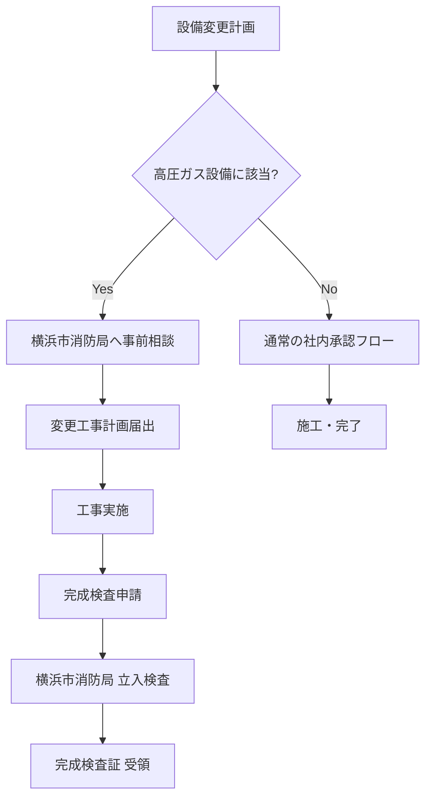

# 石油コンビナート法対応

## 当工場沿岸地区の法的位置づけ

沿岸埋立地は**石油コンビナート等特別防災区域（政令指定）**。この指定により、通常の工場より厳格な法規制が適用される。

## ⚠️ 2025年4月 重要変更：高圧ガス許可窓口の変更

!!! danger "2025年4月1日施行"
    当工場沿岸地区（コンビナート区域）の高圧ガス製造許可等の申請窓口が変更された：

    - **変更前**: 神奈川県 産業労働局
    - **変更後**: **横浜市消防局 予防部 安全指導課**（***-****-****）

    設備変更届・完成検査はすべて横浜市消防局へ提出すること。

## 設備変更時のフロー（当工場固有）

## 石油コンビナート等災害防止法の主な義務

| 義務 | 内容 | 当工場での注意点 |
|------|------|--------------|
| 防災計画の策定 | 隣接事業者・消防と連携した計画 | 沿岸埋立地内の14社共同で協議 |
| 緊急連絡体制 | 沿岸埋立地出張所（消防）への即時通報 | 自衛消防隊の編成・訓練必須 |
| 危険物数量報告 | 定期的な在庫報告 | 製品変更・増量時は都度届出 |
| 自衛消防組織 | 一定規模以上は専任消防隊 | 化学消火剤の備蓄基準あり |

## 電気設備変更と法令の関係

以下の工事は**届出または許可が必要**な可能性がある：

| 工事内容 | 関連法令 | 確認先 |
|---------|---------|--------|
| 高圧受電設備の改造 | 電気事業法 | 経済産業省（中部近畿産業保安監督部） |
| 高圧ガス設備の電気系統変更 | 高圧ガス保安法 | **横浜市消防局**（2025〜） |
| 危険物設備の電気設備変更 | 消防法 | 横浜市消防局 |
| 防爆エリアの機器変更 | 高圧ガス保安法 + 労安法 | 同上 |

!!! tip "事前相談を必ず行う"
    2025年4月の窓口変更後、手続きフローが変わっている可能性がある。
    設備変更計画の初期段階で横浜市消防局（***-****-****）に事前相談すること。
