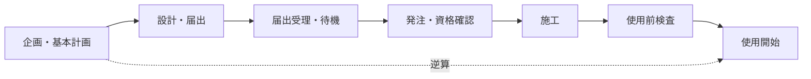

# 電気計装工事の法令手続きガイド

**対象読者**: :material-account-hard-hat: 電気主任技術者 / :material-account: 電気担当

このページは「どのフェーズで何の法令手続きが要るか」を1枚で俯瞰する**ハブ**です。各手続きの様式・数値・条文解説は書かず、既存の正典ページへリンクします。

---

## 30秒まとめ

> 電気計装工事の法令手続きは、**逆算**がすべてです。
>
> - **届出**は着工前に済ませる（受理から待機期間があるため、着工日から逆算して提出する）
> - **検査**は使用開始前に通す（使用前自主検査・完成検査などが未了だと使用開始できない）
> - **資格・登録**は発注前に確認する（施工業者の資格・登録は契約段階で確定させる）

## このページの使い方と姉妹ページ

- 法令の**中身**（届出の要否・数値・様式）を知りたい → 各節のリンク先（[法定業務一覧](legal-duties.md) や [設備投資フロー](../04-sekkei/investment-flow.md)、[電気設計の適用規格](../04-sekkei/standards.md)）へ
- 工事の**品質・検収**の進め方を知りたい → [工事フロー全体図](../03-koji-kenshu/flow-overview.md) と [工事完了後の受入実務](../03-keiso/koji-kanryo.md) へ
- **本ページ**の役割 → それらに横串を通す「工事フェーズ × 法令」の時系列マップです

---

## 全体マップ: 工事フェーズ×法令マトリクス

行が工事の6フェーズ、列が関係法令です。○ はそのフェーズで手続き・確認が発生することを示し、リンクは本ページ内の該当節へ飛びます。中身は各節のリンク先（正典ページ）で確認してください。

| フェーズ | 電気事業法 | 工事士法・業法 | 高圧ガス保安法 | 消防法 | 労働安全衛生法 | 電力会社手続き |
|---------|:---------:|:-------------:|:-------------:|:-----:|:-------------:|:-------------:|
| ①企画・基本計画 | [○](#p1) | — | [○](#p1) | [○](#p1) | — | [○](#p1) |
| ②設計・届出 | [○](#p2) | — | [○](#p2) | [○](#p2) | — | [○](#p2) |
| ③発注・業者選定 | — | [○](#p3) | — | — | — | — |
| ④施工 | — | — | — | — | [○](#p4) | [○](#p4) |
| ⑤検査・試運転 | [○](#p5) | — | [○](#p5) | [○](#p5) | — | — |
| ⑥使用開始・竣工後 | [○](#p6) | — | — | — | — | [○](#p6) |

!!! note "電力会社手続きは法令ではありません"
    表の「電力会社手続き」列（事前協議・停電申請・受電点確認）は、電力会社との**契約・運用上の手続き**であって法令上の届出ではありません。ただし着工前提になる場合が多いため、法令手続きと同じ時間軸で管理します。詳細は [電力会社との窓口](denryoku-toiawase.md) を参照してください。

---

## フェーズ①: 企画・基本計画（着工6か月前〜） { #p1 }

| 手続き・確認 | 実施者 | 目安時期 | 根拠法令 | 詳細リンク |
|-------------|-------|---------|---------|-----------|
| 届出要否のスクリーニング | 電気主任 | 企画時 | 電気事業法 | [法定業務一覧](legal-duties.md) |
| 予算・投資フロー整合 | 設計担当 | 企画時 | （社内手続き） | [設備投資フロー](../04-sekkei/investment-flow.md) |
| 高圧ガス・危険物への影響有無 | 設計担当 | 企画時 | 高圧ガス保安法・消防法 | [設備投資フロー](../04-sekkei/investment-flow.md) |
| 電力会社への事前協議 | 電気主任 | 企画時 | （電力会社手続き） | [電力会社との窓口](denryoku-toiawase.md) |
| 変更管理（MOC）登録 | 設計担当 | 企画時 | （社内手続き） | [設備更新設計](../04-sekkei/renovation-design.md) |

!!! tip "この段階で届出要否を「当たり」だけ付ける"
    正式な要否判定は設計が固まってからですが、企画段階で「届出が要りそうか」だけでも見立てておくと、後工程のリードタイム逆算（[リードタイムと落とし穴](#leadtime)）が現実的になります。要否の判断軸は [法定業務一覧](legal-duties.md) にあります。

## フェーズ②: 設計・届出（着工1〜3か月前） { #p2 }

| 手続き・確認 | 実施者 | 目安時期 | 根拠法令 | 詳細リンク |
|-------------|-------|---------|---------|-----------|
| 工事計画届出と待機期間の確認 | 電気主任 | 着工前 | 電気事業法 | [法定業務一覧](legal-duties.md) |
| 高圧ガス設備の変更手続き | 設計担当 | 着工前 | 高圧ガス保安法 | [設備投資フロー](../04-sekkei/investment-flow.md) |
| 危険物・消防設備の変更手続き | 設計担当 | 着工前 | 消防法 | [設備投資フロー](../04-sekkei/investment-flow.md)・[適用規格](../04-sekkei/standards.md) |
| 防爆エリアの機器選定・確認 | 計装担当 | 設計時 | 消防法・労安則等 | [防爆設計の基礎](../03-keiso/explosion-proof.md) |
| 停電計画の申請 | 電気主任 | 着工前 | （電力会社手続き） | [電力会社との窓口](denryoku-toiawase.md) |

!!! warning "届出には受理後の待機期間がある"
    工事計画届出は「出せばすぐ着工できる」ものではなく、受理後に法定の待機期間が発生します。**要否・待機日数・対象規模の数値は書きません**（正典に既出）。[法定業務一覧](legal-duties.md) の工事計画届出の項で確認し、待機期間の終了日から逆算して提出してください。

## フェーズ③: 発注・業者選定 { #p3 }

| 手続き・確認 | 実施者 | 目安時期 | 根拠法令 | 詳細リンク |
|-------------|-------|---------|---------|-----------|
| 施工業者の資格・登録確認 | 発注担当 | 発注前 | 電気工事士法・電気工事業法 | [制御盤撤去ガイドライン](../guidelines/seigyoban-tekkyo-guideline.md) |
| 契約への法令対応事項の明記 | 発注担当 | 契約時 | （契約事項） | 下記 |

**契約時に法令対応として明記する項目**（5点）:

- 有資格者による施工であること（資格区分の確認は上表リンク先。**資格区分・閾値の数値は本ページに書きません**）
- 届出・検査に必要な図書・試験記録をベンダーが提出すること
- As-built 図面など品質関連の納入物（詳細は [工事完了後の受入実務](../03-keiso/koji-kanryo.md) へ）
- 施工中の作業許可・特別教育の遵守（下記フェーズ④）
- 事故発生時の連絡・報告義務の分担

!!! danger "資格・登録は「発注前」に確定させる"
    施工開始後に「有資格者がいなかった」と判明すると手戻りが大きくなります。電気工事士法・電気工事業法の要求は発注段階でクリアしてください。具体の資格区分は [制御盤撤去ガイドライン](../guidelines/seigyoban-tekkyo-guideline.md) を参照します。

## フェーズ④: 施工 { #p4 }

| 手続き・確認 | 実施者 | 目安時期 | 根拠法令 | 詳細リンク |
|-------------|-------|---------|---------|-----------|
| 作業許可（PTW）の発行 | 電気主任・現場 | 作業前 | 労働安全衛生法 | [作業許可（PTW）](../10-safety/ptw.md)・[作業許可ガイド](../guidelines/work-permit.md) |
| 特別教育の受講確認 | 現場責任者 | 作業前 | 労働安全衛生法 | [特別教育](../10-safety/special-education.md) |
| 停電作業の段取り | 電気主任 | 作業前 | 労働安全衛生法 | [停電作業](../05-hozen/outage-work.md) |
| 施工中の事故発生時の対応 | 電気主任 | 発生時 | 電気事業法等 | [電気事故対応と報告](jiko-taiou.md) |

!!! warning "施工フェーズは労安が主役"
    このフェーズで発生するのは主に労働安全衛生法上の手続き（作業許可・特別教育・停電作業）です。感電・電気火災などの事故が起きた場合の報告義務は電気事業法側で、対応フローは [電気事故対応と報告](jiko-taiou.md) にまとめています。

## フェーズ⑤: 検査・試運転 { #p5 }

使用開始の前に通すべき検査です。**条番号は一次照合（e-Gov）ができていないため、以下では条番号を書かず「要確認」とします**（誤った条番号を書かない方針）。

- **使用前自主検査**: 一定規模以上の電気工作物は、使用開始前に設置者自身が技術基準への適合を確認する検査を行います（根拠条番号は要確認）。
- **使用前安全管理審査**: その自主検査の**実施体制・方法**が適切かを、登録審査機関などが審査する仕組みです（根拠条番号は要確認）。対象規模の閾値・手続きの詳細は書かず、[法定業務一覧](legal-duties.md) と所轄の産業保安監督部の案内で確認してください。
- 対象規模やタイミングの数値は正典に委ねます。要否の見立ては [法定業務一覧](legal-duties.md) の工事計画届出・使用前検査の項を参照します。

| 手続き・確認 | 実施者 | 目安時期 | 根拠法令 | 詳細リンク |
|-------------|-------|---------|---------|-----------|
| 使用前自主検査・使用前安全管理審査 | 電気主任 | 使用開始前 | 電気事業法（条番号要確認） | [法定業務一覧](legal-duties.md) |
| 高圧ガス完成検査 | 設計・保安担当 | 使用開始前 | 高圧ガス保安法 | [設備投資フロー](../04-sekkei/investment-flow.md) |
| 消防検査 | 設計・保安担当 | 使用開始前 | 消防法 | [設備投資フロー](../04-sekkei/investment-flow.md) |
| 社内の受入・検収 | 設計・保全担当 | 完成報告後 | （社内手続き） | [受入実務](../03-keiso/koji-kanryo.md)・[工事フロー全体図](../03-koji-kenshu/flow-overview.md) |

!!! note "法定検査と社内検収は別物"
    使用前自主検査などの**法定検査**と、社内の**受入・検収**は目的が異なります。前者は技術基準適合、後者は契約履行・品質確認です。両者の関係と検収の実務は [工事完了後の受入実務](../03-keiso/koji-kanryo.md) にあります。

## フェーズ⑥: 使用開始・竣工後 { #p6 }

| 手続き・確認 | 実施者 | 目安時期 | 根拠法令 | 詳細リンク |
|-------------|-------|---------|---------|-----------|
| 保安規程・設備台帳・図面の更新 | 電気主任 | 竣工後速やか | 電気事業法 | [保安規程の管理](hoan-kisoku.md)・[設備更新設計](../04-sekkei/renovation-design.md) |
| 竣工後の法定書類の整備 | 設計・保安担当 | 竣工後 | 各法令 | [設備投資フロー](../04-sekkei/investment-flow.md) |
| 省エネ法上の届出（該当時） | エネルギー管理担当 | 竣工後 | 省エネ法 | [省エネ法対応](../08-energy/energy-law.md) |

!!! tip "図面・台帳の更新漏れが後年の事故を生む"
    設備を変えたら保安規程・単線結線図・設備台帳を実態に合わせて更新します。更新設計の進め方は [設備更新設計](../04-sekkei/renovation-design.md) を参照してください。

---

## 法令別逆引きインデックス

「この法律の手続きはどこ？」から引くための索引です。中身は正典ページにあります。

| 法令 | 主に関わるフェーズ | 本ページ内リンク | 正典ページ |
|------|------------------|-----------------|-----------|
| 電気事業法 | ①②⑤⑥ | [①](#p1)・[②](#p2)・[⑤](#p5)・[⑥](#p6) | [法定業務一覧](legal-duties.md) |
| 電気工事士法・電気工事業法 | ③ | [③](#p3) | [制御盤撤去ガイドライン](../guidelines/seigyoban-tekkyo-guideline.md) |
| 高圧ガス保安法 | ①②⑤ | [①](#p1)・[②](#p2)・[⑤](#p5) | [設備投資フロー](../04-sekkei/investment-flow.md) |
| 消防法（危険物・防爆） | ①②⑤ | [①](#p1)・[②](#p2)・[⑤](#p5) | [防爆設計の基礎](../03-keiso/explosion-proof.md)・[適用規格](../04-sekkei/standards.md) |
| 労働安全衛生法 | ④ | [④](#p4) | [作業許可（PTW）](../10-safety/ptw.md)・[特別教育](../10-safety/special-education.md) |
| 省エネ法 | ⑥ | [⑥](#p6) | [省エネ法対応](../08-energy/energy-law.md) |
| 電力会社手続き（法令外） | ①②④⑥ | [①](#p1)・[②](#p2)・[④](#p4)・[⑥](#p6) | [電力会社との窓口](denryoku-toiawase.md) |

!!! note "本ガイドで扱わない法令"
    建築基準法（受変電室の建屋・防火区画など）は工事内容により関わりますが、本ガイドの対象外として1行注記に留めます。火薬類取締法は電気計装工事の一般的範囲では扱いません。

---

## リードタイムと落とし穴 { #leadtime }

法令手続きは「着工日・使用開始日から逆算」して段取りするのが鉄則です。下図は逆算の考え方の一例です（具体日数は正典ページで確認してください）。

### よくある落とし穴

- **届出前に着工してしまう**: 待機期間を見落として着工すると法令違反になります。要否と待機の考え方は [法定業務一覧](legal-duties.md) へ。
- **「軽微変更」を自己判断で広げる**: 軽微だと思って届出を省いたら対象だった、という誤判断。判断に迷う場合は [法定業務一覧](legal-duties.md) と所轄の産業保安監督部で確認します。
- **停電申請の遅れ**: 電力会社の停電申請は締切が早く、遅れると工程全体がずれます。段取りは [電力会社との窓口](denryoku-toiawase.md) へ。
- **有資格者・登録の確認漏れ**: 発注後に発覚すると手戻り。対処は [制御盤撤去ガイドライン](../guidelines/seigyoban-tekkyo-guideline.md) と契約段階での明記（フェーズ③）で防ぎます。
- **検査未了のまま使用開始**: 使用前自主検査などが済む前に使い始めない。段取りは [工事完了後の受入実務](../03-keiso/koji-kanryo.md) と本ページ [フェーズ⑤](#p5) を参照。

!!! danger "迷ったら「着工前・使用開始前」で止めて確認"
    法令手続きの多くは「着工前」「使用開始前」というゲートを持ちます。判断に自信がないときは、そのゲートで一旦止めて、正典ページと所轄窓口で確認してから進めてください。

---

## 関連記事

- [法定業務一覧](legal-duties.md) — 工事計画届出の要否・事故報告・法定点検（法令の中身の正典）
- [保安規程の管理](hoan-kisoku.md) — 竣工後の保安規程・台帳更新
- [電力会社との窓口](denryoku-toiawase.md) — 事前協議・停電申請・受電点確認
- [電気事故対応と報告](jiko-taiou.md) — 施工中・使用後の事故対応
- [設備投資フロー](../04-sekkei/investment-flow.md) — 投資判断視点での工事フローと各種完成検査
- [工事フロー全体図](../03-koji-kenshu/flow-overview.md) — 品質・検収視点の6段階フロー
- [工事完了後の受入実務](../03-keiso/koji-kanryo.md) — 完成報告後の受入・検収実務
