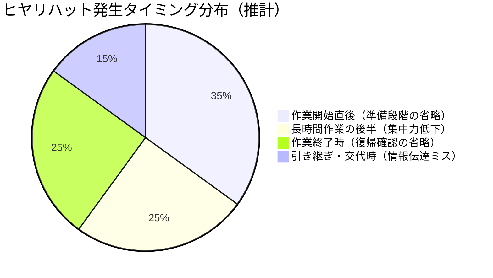

# よくあるミス・ヒヤリハット集

## 30秒まとめ

電気計装現場のヒヤリハットは「確認の省略」「思い込み」「手順の飛ばし」の3パターンに集約される。
本記事では30件の実例を示し、それぞれの状況・何が起きたか・対策を記録した。
自分が経験する前に読んでおくことが目的。

---

## なぜヒヤリハットを学ぶか

ハインリッヒの法則では、1件の重大事故の背後に29件の軽傷事故と300件のヒヤリハットがある。電気計装の現場では「感電・爆発・誤動作による製造停止」が重大事故に直結する。

若手エンジニアが最初にやりがちなミスは「知識の穴」より「確認を省いた自信」から生まれる。現場経験が浅いうちは「前の人がやったから大丈夫」「たぶん停電してるはず」という思い込みが最も危険。

---

## カテゴリ別ヒヤリハット集

### 停電・検電作業（8件）

| # | 状況 | 何が起きたか / 起きそうだったか | 対策・チェックポイント |
|---|------|-------------------------------|----------------------|
| 1 | 検電器の電池切れを確認せず停電確認 | 検電器が無反応 → 「停電完了」と判断し作業着手 → 実は活線だった | 検電前に活線部位で動作確認。電池残量を毎回確認 |
| 2 | 「この設備は停電したはず」と思い込んで検電を省略 | 二次側は通電したまま。接触直前でヒヤリ | 思い込み禁止。検電は毎回・必ず実施 |
| 3 | 3相のうち1相だけ確認して停電と判断 | 残り2相は活線。工具が充電部に接触 | 3相すべてで検電。R・S・T全相確認 |
| 4 | 上位ブレーカーを切ったが下位からの逆送電を見落とした | バックフィードで充電状態が継続 | 単線結線図で電源経路を全て確認してから短絡接地 |
| 5 | 自分の作業が終わったので短絡接地を撤去した | 他の作業者がまだ同じ回路で作業中 | 自分の錠は自分しか外さない。全員退避確認後に撤去 |
| 6 | 停電範囲の確認を口頭だけで行い書面化しなかった | 範囲の認識が担当者間でずれており別ラインを停電 | 停電申請書に停電範囲・母線番号・フィーダーを明記 |
| 7 | 「5分だけ」と思い保護具なしで短時間作業 | 絶縁手袋なしで低圧盤内の配線確認中に感電ヒヤリ | 作業時間に関係なく保護具着用。例外なし |
| 8 | 復電前チェックリストを「いつもと同じ」とスキップ | 試験用の短絡線が端子台に残ったまま復電 → トリップ | 復電前は必ずチェックリストを1項目ずつ確認 |

!!! danger "短絡接地の撤去は取り付けた本人のみ"
    「自分が付けたものは自分が外す」がLOTOの大原則。他人が付けた接地を外すことは、その人が作業中であることを無視した行為。死亡事故の直接原因になる。

---

### 計装・配線作業（7件）

| # | 状況 | 何が起きたか / 起きそうだったか | 対策・チェックポイント |
|---|------|-------------------------------|----------------------|
| 9 | シールドケーブルの両端を接地した | インバータノイズがシールドを伝播してセンサが誤動作 | シールド接地は片端のみ（制御室側）が基本 |
| 10 | 4-20mA回路の＋/−を逆接続 | センサが動作しない、または電流計が振り切れる | 配線前に回路図の極性を必ず確認。テスタで極性チェック |
| 11 | 校正後にセンサをプロセス配管に再接続したが、プロセス弁の開操作確認を省略 | 配管内圧力が正常に計測されず、制御外れを起こしかけた | 校正後の復帰手順にはプロセス弁操作確認を含める |
| 12 | 熱電対（TC）の端子に測温抵抗体（RTD）を接続 | 入力種別の違いでDCS温度表示が大幅に異なる | 計器銘板・仕様書で入力種別を必ず確認してから配線 |
| 13 | マルチペアケーブルのシールドをパネル内でバラバラに処理 | シールドとして機能せずノイズが各チャンネルに流入 | シールドは一点で束ねてグランドバーに接続 |
| 14 | 端子番号を目視のみで確認し、隣の端子に接続 | 類似したケーブルが隣り合っており信号が入れ替わった | 端子番号を声に出して確認（指差し呼称）。テスタで導通確認 |
| 15 | DCSのアナログ入力をフィールドで短絡テスト後、バイパスSWを戻し忘れ | 手動バイパス状態のまま自動運転に移行 → インターロックが無効 | 試験後の復帰状態を「試験前の状態と比較」して確認 |

!!! warning "シールド接地の方向を間違えるとノイズ対策が逆効果"
    シールドを両端接地するとグラウンドループが形成され、インバータ誘導ノイズをシールドが「伝える管」になる。片端（通常は制御室側）のみ接地が原則。

---

### PLC・DCS操作（6件）

| # | 状況 | 何が起きたか / 起きそうだったか | 対策・チェックポイント |
|---|------|-------------------------------|----------------------|
| 16 | バックアップなしでPLCプログラムを変更 | 変更後に動作不良が発生。元に戻せなくなった | 変更前に必ずバックアップ。ファイル名に日時を付ける |
| 17 | 本番PLCと試験PLCを混同してプログラムを書き込んだ | 本番ラインが即停止。製造課に多大な影響 | 機器ラベル確認＋IPアドレス確認のダブルチェック |
| 18 | 強制ON（強制出力）を試験後に解除し忘れた | センサ入力を無視したまま設備が自動運転を継続 | 強制ON/OFFの実施・解除は必ずペアで記録する台帳を作る |
| 19 | DCSのトレンドデータを削除してしまった | 設備異常の証拠となる5日分のトレンドが消失 | 削除操作は必ず上長確認。定期バックアップを設定 |
| 20 | HMI画面のボタンを誤タッチし弁を開操作 | 別ラインへのプロセス液が流れた。製造品質に影響 | HMIの重要操作は「確認ポップアップ」を必ず設ける |
| 21 | WatchDogエラーが発生したPLCを「再起動すれば治る」と繰り返した | 根本原因（電源品質の悪化）を放置。数日後にCPU故障 | WatchDogエラーは1回でも根本原因を調査する |

!!! danger "本番PLCへの直接書き込み前に必ずバックアップ"
    PLC/DCSの変更は「まず現状保存、変更、動作確認、問題あれば即リストア」の順序を守る。バックアップなしの変更は修復不能なダウンタイムにつながる。

---

### 防爆エリア（5件）

| # | 状況 | 何が起きたか / 起きそうだったか | 対策・チェックポイント |
|---|------|-------------------------------|----------------------|
| 22 | 事務所用の電動工具を防爆エリアに持ち込んだ | ブラシモーターの火花が可燃性ガス雰囲気に | 防爆エリアへの持ち込み物はすべて防爆認定品のみ |
| 23 | 防爆機器の端子箱の蓋を閉め忘れたまま通電 | 防爆性能が失われた状態でプロセスが稼働 | 作業完了チェックリストに「防爆蓋の締め付けトルク確認」を追加 |
| 24 | ガス検知なしで防爆エリアで電気作業を開始 | 作業中にガス漏れが発生。アーク発生で引火リスク | 防爆エリアの作業前は必ず可燃性ガス濃度を検知 |
| 25 | 防爆機器のケーブルグランドを規定トルク未満で取り付け | 振動でグランドが緩み、防爆構造が破損 | トルク管理と定期確認を施工記録に記録 |
| 26 | 防爆認定が切れた旧型機器をそのまま使い続けた | 更新を怠ったことが法定点検で指摘事項になった | 防爆機器の認定期限・機器台帳を年1回見直す |

---

### 復電・起動確認（4件）

| # | 状況 | 何が起きたか / 起きそうだったか | 対策・チェックポイント |
|---|------|-------------------------------|----------------------|
| 27 | 試験端子の短絡片（テストプラグ）を元に戻し忘れて復電 | 保護継電器が無効のまま設備が通電。即トリップ | 復電前チェックリストに「試験端子の復帰確認」を含める |
| 28 | モーター試運転前の絶縁抵抗確認を省略 | 巻線の絶縁不良のまま通電し焼損 | 電動機の通電前は絶縁抵抗測定（1MΩ以上を確認） |
| 29 | 計装配管のエア抜き弁を開状態で起動 | プロセス液が計装配管に流れ圧力計が破損 | 復電・起動前に計装配管の弁状態を全点確認 |
| 30 | 位相確認なしで変圧器を並列運転に投入 | 位相差による大きな循環電流が発生。遮断器トリップ | 並列投入前は同期検定（電圧・位相・周波数）を必ず確認 |

---

## ミスが起きやすいタイミング



| タイミング | リスクの理由 | 対策 |
|-----------|-------------|------|
| **作業開始直後** | 急ぎや慣れから準備手順を省略しやすい | チェックリストを声に出して確認 |
| **長時間作業後半** | 集中力・注意力が低下 | 2時間を目安に休憩。重要作業は午前中に集中 |
| **作業終了時** | 「終わった」という安堵感で確認を省略 | 「終わり確認」を「始め確認」と同レベルで実施 |
| **引き継ぎ時** | 伝達漏れ・聞き間違いが起きやすい | 書面での申し送り。「実施済み」「未実施」を明記 |

---

## ヒヤリハットを報告文化にするために

### 報告フォーマット（5W1H + 対策）

```
【日時】YYYY-MM-DD HH:MM
【場所】設備種別・エリア名
【状況】作業中に何をしていたか
【何が起きたか】危険事象または危険に気づいた経緯
【原因（推定）】なぜそうなったか
【対策】再発防止のために変えること
```

!!! tip "報告は「自分を守る記録」でもある"
    ヒヤリハット報告は責任追及のためではなく、同じ失敗を繰り返さないための情報共有。報告した事実が「問題を発見した」という証拠になる。報告しなかったことが後に問われる方がリスクが高い。
