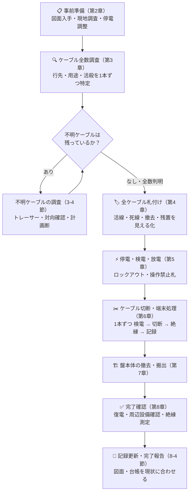
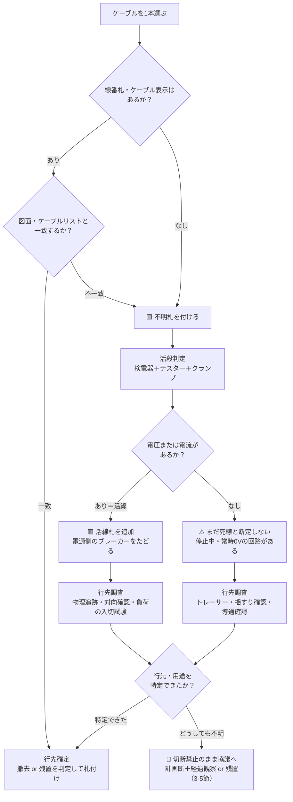

# 制御盤撤去工事ガイドライン

> 制御盤の撤去は「外して捨てるだけ」の工事ではありません。**何につながっているか分からないケーブルを1本ずつ特定し、札で見える化し、安全を確認してから切る**——この地道な手順こそが工事の本体です。本ガイドラインは、経験の浅い作業者でも感電ゼロ・誤切断ゼロ・無停電トラブルゼロで工事を完遂できることを目標に、調査 → 札付け → 停電 → 切断 → 撤去 → 後始末の全工程を定めます。

| 項目 | 内容 |
|------|------|
| 対象工事 | 低圧（交流 600 V 以下／直流 750 V 以下）の制御盤・動力盤・分電盤の撤去（DC24 V／48 V 等の制御・計装電源回路を含む） |
| 適用範囲 | 事前調査から停電・切断・搬出・完了報告まで |
| 対象外 | 高圧受電設備（キュービクル等）の撤去・高圧充電部の作業（電気主任技術者の指揮のもと別途計画する）。活線（帯電）のままの切断・解線作業も対象外です（原則禁止。やむを得ず行う場合は事業場の活線作業許可の手続きで別途管理） |
| 必要資格 | 電気工事士 ＋ 低圧電気取扱業務特別教育（詳細は第2章） |
| 作業体制 | 作業指揮者を定め、**2名以上**で実施（単独作業禁止） |
| 文書管理 | 文書番号・版数・承認・改訂履歴は第13章（年1回見直し） |

!!! danger "絶対に守る四大原則"
    1. **検電なくして接触なし** — すべての電線・端子は「通電中」とみなす。検電器で無電圧を確認するまで素手で触れない。
    2. **不明ケーブルは切らない** — 「行先」「用途」「活殺（通電の有無）」の3点が確定するまで切断禁止。
    3. **札のないケーブルに手を出さない** — 盤に出入りする全ケーブルに札が付き、作業指揮者が確認するまで、切断作業を開始しない。
    4. **片側だけ見て切らない** — 切断してよいのは、両端（盤側と相手側）の行先確認が取れたケーブルだけ。片端の札と検電だけで切断しない。

!!! danger "全員が持つ「作業停止の権限」（Stop Work Authority）"
    作業者・応援者・協力会社を含む**全員**が、危険または不明な状態に気づいた時点で作業を止める権限を持ちます。新人でも遠慮はいりません。止めた人を責めることも禁止します。

    停止すべき状態の例: 不明ケーブルの発見／図面と現物の不一致／停電したはずの回路で検電反応／自分の作業範囲・停電範囲を自分の言葉で説明できない／搬出経路に危険／判断できる責任者が現場にいない

    停止した作業は、原因の確認・是正と作業指揮者の承認が済むまで再開してはいけません。

!!! note "本ガイドラインの位置づけ"
    一般的な低圧制御盤撤去の標準手順をまとめた実務参考資料です。実際の工事では、事業場の安全作業規程・発注者のルール・電気主任技術者の指示が本ガイドラインに**優先**します。矛盾を感じたら自己判断せず、作業指揮者に確認してください。

---

## 1. 工事全体の流れ

まず全体像をつかみます。**切断（第6章）より前の工程に全体の7割の労力をかける**のがこの工事の正しい配分です。調査と札付けが完璧なら、当日の切断作業は「確認して切るだけ」になります。

この流れの中に、**必ず立ち止まって人の承認を得る「関所」（ホールドポイント）**が3つあります。チェックリストの自己チェックだけで素通りしないための仕組みです。

| 関所 | タイミング | 承認者 | 通過条件 |
|------|-----------|--------|---------|
| HP-1 | ケーブル切断の開始前（第6章） | 作業指揮者 | 6-1節の切断開始条件をすべて満たしている |
| HP-2 | 盤の固定解除・搬出前（第7章） | 作業指揮者 | 盤内の残配線ゼロ・接地線の処理済み・搬出経路の安全確保 |
| HP-3 | 復電前（第8章） | 施設管理者（自家用電気工作物では電気主任技術者の指示のもと） | 残置回路の端末処理・絶縁測定・関係者への周知の完了 |

---

## 2. 事前準備

### 2-1. 集める図面・書類

| 図面・書類 | 何に使うか |
|-----------|-----------|
| 単線結線図 | 電源元（どの盤のどのブレーカーから受電しているか）の特定 |
| 展開接続図（シーケンス図） | 制御回路の渡り線・インターロックの洗い出し |
| ケーブルリスト（ケーブルスケジュール） | 全ケーブルの照合台帳。調査票のベースになる |
| 盤製作図（外形図・器具配置図・端子台図） | 盤内機器・重量・端子配置の把握 |
| 幹線系統図・電源系統図 | 停電範囲の確定 |
| 建築図 | 搬出経路・防火区画の位置確認 |

!!! tip "図面がない・古い場合"
    図面と現物が違うのは「例外」ではなく「よくあること」です。図面は**仮説**、現物が**正**。図面がない場合は調査工程を厚く取り、現物から実配線図（as-built）を起こしてから工事に着手します。図面がないことを理由に調査を省略してはいけません。

### 2-2. 現地調査で確認すること

- 盤の名称・銘板（形式・製造年・概算重量）
- **電源元**: どの盤のどのブレーカーから受電しているか（系統図と現物の両方で確認）
- 盤に出入りする**ケーブルの全数**（上出し・下出し・ラック・ピット内をすべて数える）
- **渡り線**の有無: 他盤との間のインターロック・警報・遠方操作・表示用の制御線 ★最重要
- UPS・直流電源（バッテリー）・非常用電源系統の有無
- 通信線・計装線（PLCリンク・LAN・4-20 mA 信号線）の有無
- 周辺の稼働設備（撤去作業や停電の影響が及ぶ範囲）
- 搬出経路（通路幅・段差・エレベーター・吊り代＝盤を吊り上げるために必要な上方の空間余裕・養生範囲）
- 作業スペース・照明・換気

### 2-3. 関係者との調整

- 停電範囲と影響設備を一覧化し、施設管理者・発注者と**停電日時を合意**する
- 撤去する盤を**経由**して他設備に電源・信号が渡っていないか（渡っている場合は切替・移設工事を先行）
- 停電当日の周知（掲示・放送・関係部署への連絡）
- 電気主任技術者への工事内容の報告と指示の受領（自家用電気工作物の場合）
- **撤去範囲（スコープ）を着工前に書面で確定する**: ①盤本体のみか、ケーブルを電源元まで撤去するか（途中残置か）、②ケーブルラック・電線管・支持架台・基礎・アンカーを含むか、③接地線・接地極を含むか、④他盤と共用する母線・ラック・ピットの扱い。境界が曖昧なまま着工すると、撤去しすぎ（他設備への波及）と撤去不足（ケーブルの宙吊り残置）の双方のトラブルになります
- **上位監視盤（DCS・中央監視・上位PLC）側の事前処理を依頼する**: 撤去する盤から信号を送っている場合、停電すると相手側で通信断・接点断の警報が一斉発報します。撤去前に監視盤の担当者へ該当ポイントの警報マスク（点検中扱い）・ポイント無効化を依頼し、撤去完了後にポイント自体の削除まで依頼します
- **停電可能な時間帯と撤退リミットを決める**: 瞬断も許されない設備（サーバー・通信・製造ライン等）が関係する場合は、停電可能な時間帯（夜間・休日）と最大停電時間を取り決めます。あわせて「この時刻までに終わらなければ作業を中止して復電可能な状態に戻す」という撤退判断の時刻も事前に決めておきます
- **施工を外部へ発注する場合は、仕様書に次の4点を明記する**: ①撤去してよいのは「撤去札＋無電圧確認＋両端確認＋発注者承認」がそろったケーブルのみ、②不明・図面不一致のケーブルは切断禁止、③仕様外・不明・危険を発見したら作業を停止して報告、④発注者の承認なくジャンパ・バイパス・追加撤去・作業範囲の変更をしない
- **施工会社の力量を事前に評価する**: ①必要な資格・特別教育の保有者名簿の提出を受ける ②同種工事の実績・安全成績を確認する ③作業指揮者となる者を指名で確認する。仕様書（成果物要求）を満たせる体制かを着工前に確認します
- **現場入場時教育（受入れ教育）を実施する**: 発注者は施工会社の従事者へ、この現場の停電範囲・札の意味（4-1節）・緊急時対応（5-6節）・作業停止権限を入場前に説明し、実施を記録に残します。元請・下請が混在する場合は、誰が停電操作の主管かも明確にします
- **作業許可書（Permit to Work 相当）を書面で発行する**: 外部発注では、停電・隔離の完了、作業範囲、許可の有効期限を記した作業許可書を発注者が発行し、ホールドポイント HP-1 通過の記録として完了報告書に綴じます

### 2-4. 体制と資格

| 区分 | 必要な資格・教育 |
|------|----------------|
| 一般用電気工作物の工事 | 第二種電気工事士以上 |
| 自家用電気工作物（最大電力 500 kW 未満の需要設備）の工事 | 第一種電気工事士（600 V 以下の部分は認定電気工事従事者でも可） |
| 自家用電気工作物（500 kW 以上） | 電気工事士法の対象外。電気主任技術者の保安監督のもとで施工 <!-- lint-ok: N5 電気工事士法の資格区分・選任義務の記述ではない --> |
| 停電・検電・低圧充電電路の取り扱い | 低圧電気取扱業務特別教育（労働安全衛生規則 第36条第4号） |
| 吊り上げ搬出がある場合 | 玉掛け技能講習等 |

- 低圧電気取扱業務特別教育は、充電電路の敷設・修理を伴う作業と、区画された場所での開閉器の操作のみの作業とで受講区分（実技時間）が異なります。作業内容に合った区分を受講していることを確認してください
- 電気工事士法の「電気工事」は「設置し、又は変更する工事」と定義されています。既設の電気工作物の配線切離し・端末処理・回路変更・残置回路の処理を伴う撤去は、実質的に既設設備を「変更する工事」に当たるため、電気工事士等の有資格者による施工を原則とします。盤の搬出・廃材運搬のみの場合も、その前提となる電気的安全確認（検電・無電圧確認）は有資格者が行います（軽微な工事を除く）→ [電気工事士法 第2条（定義・軽微な工事）](https://kfurufuru.github.io/denken-wiki/articles/other/koji-shi-2/)・[第3条（電気工事士の資格）](https://kfurufuru.github.io/denken-wiki/articles/other/koji-shi-3/)
- 作業指揮者を定め、停電作業の指揮・札と施錠の確認を行わせます（労働安全衛生規則 第350条）

**主な判断の承認者（迷ったらこの表）**

| 判断 | 承認者・決定者 |
|------|---------------|
| 撤去範囲（スコープ）の確定・変更 | 発注者・施設管理者 |
| 停電範囲・停電日時・復電 | 施設管理者（自家用電気工作物では電気主任技術者の指示のもと） |
| 切断開始・中断後の再開・手順の変更 | 作業指揮者 |
| 不明ケーブルの最終処置（残置・計画断） | 発注者・施設管理者・電気主任技術者の協議 |
| 完了の確認 | 発注者（完了報告書の受領） |

### 2-4-1. 本ガイドラインの教育と力量の維持

資格・特別教育の保有に加えて、本ガイドラインそのものへの理解を作業従事の条件とします。

| 対象 | 実施内容 | 頻度 | 記録 |
|------|----------|------|------|
| 新規従事者 | 本ガイドラインの読み合わせ＋四大原則・札・全端子検電の理解度確認 | 初回従事の前 | 教育記録（受講者・実施者・実施日・確認結果） |
| 全従事者 | 改訂時の周知（変更点の説明と再確認） | 改訂の都度 | 周知記録 |
| 全従事者 | 再教育（事故・ヒヤリハット事例の振り返りを含む） | 年1回 | 再教育記録 |

- 教育・訓練の記録は本ガイドラインの管理元が保管します（保管期間は 8-5節によります）
- 理解度が不十分な者には、作業指揮者の判断で単独での切断判定を行わせず、確認者として同行させます

### 2-5. 工具・保護具・測定器リスト

| 区分 | 品目 | 用途・使用前確認 |
|------|------|----------------|
| 測定器 | 低圧検電器 | 活殺判定・無電圧確認。**使用前にテストボタンか既知の電源で動作確認**（労働安全衛生規則 第352条の使用前点検） |
| 測定器 | テスター | 電圧値の測定・AC/DC の判別・導通確認 |
| 測定器 | クランプメーター | 通電電流の有無をケーブルを切らずに確認 |
| 測定器 | 絶縁抵抗計（メガー） | 完了時の絶縁測定・死線のペア特定 |
| 測定器 | ケーブルトレーサー（トーンジェネレータ＋プローブ） | 死線の行先特定 |
| 保護具 | 低圧用絶縁手袋・保護メガネ・ヘルメット・絶縁靴 | 着用前に外観点検（手袋は空気試験: 袖口を折り込んで空気を封じ、膨らませて空気漏れ・ピンホールがないか確認） |
| 安全用品 | 操作禁止札・ロックアウト器具（南京錠・ハスプ） | ブレーカーの誤投入防止 |
| 安全用品 | 絶縁シート・絶縁カバー | 残置する活線部の養生 |
| 安全用品 | 絶縁救助フック（または乾いた木材・FRP棒） | 万一の感電時に、被災者を充電部から引き離す（5-6節）。作業区画内に常備 |
| 工具 | 絶縁柄のケーブルカッター・ニッパ・ドライバー類 | 切断・解線 |
| 材料 | 各種札（第4章）・結束バンド・マーキングテープ | ケーブルの見える化 |
| 材料 | ビニルテープ・絶縁キャップ | 切断端末の**即時**絶縁処理 |
| 記録 | カメラ・ケーブル調査票・筆記具 | 作業前後の写真・調査記録 |

- 残置する活線部の近くで作業する場合は、絶縁手袋に加えてフェイスシールド・絶縁マットを併用します（低圧でも大容量回路の短絡アークは危険です）
- テスター・検電器・クランプメーターは、測定する回路に適合した**測定カテゴリ（CAT III 以上を目安）**と定格電圧のものを使用します。定格ラベルの確認とリード線被覆の損傷点検を使用前に行います（低定格の測定器を盤の電源側に当てると、過渡過電圧で測定器が破損し受傷するおそれがあります）
- 作業前に、指輪・金属バンドの腕時計・ネックレスなどの**金属製装身具を外します**。低圧でも短絡すれば大電流で装身具が発熱・溶着し、重度の熱傷を負います

---

## 3. ケーブル調査と不明ケーブルの取り扱い

本工事で最も重要な章です。**事故のほとんどは「分かったつもりのケーブル」から起きます。**

### 3-1. なぜ不明ケーブルが生まれるのか

- 増設・改造の繰り返しで、図面が現物に追いついていない
- 廃止した設備のケーブルが、撤去されずに残置されている
- 線番札が脱落・退色して読めない
- 前任者が記録を残さなかった

つまり不明ケーブルは「前任者の記録不備の遺産」です。だからこそ、この工事の最後には**自分が正しい記録を残す**ことまでが仕事に含まれます（8-4節）。

### 3-2. 調査の進め方

1. 盤に出入りする全ケーブルを数え、**1本ずつ番号を振って調査票に登録**する（数が合わない＝見落としがある）
2. 線番札・ケーブル表示をケーブルリスト・図面と照合する
3. 照合できないケーブルには**不明札（黄）**を付け、3-3節のフローで調査する
4. 全ケーブルの「行先・用途・活殺」が確定し、調査票の空欄がゼロになったら調査完了

### 3-3. 不明ケーブル判定フロー

フローに入る前に、**不明ケーブルを見つけた瞬間の初動**を体に入れておきます。

1. 作業の手を止める（そのケーブルに触れない・切らない）
2. 不明札（黄）と仮番号札を付ける
3. 写真を撮る（全景と、札・端子部のアップ）
4. 発見場所・外観（種類・サイズ・色）・端子番号や線番を調査票に記録する
5. 作業指揮者へ報告する
6. 調査の担当者を決める
7. 判定が完了するまで切断禁止のまま、ほかの作業に移る

### 3-4. 調査手法カタログ

| 手法 | 対象 | 何が分かるか | 注意点 |
|------|------|-------------|--------|
| 線番札・シース表記の確認 | 全ケーブル | 回路名・行先（記載が正しければ） | 札も誤っていることがある。鵜呑みにせず必ず図面・現物と照合 |
| 検電器 | 活線 | 交流電圧の有無 | 使用前に動作確認。直流・シールド付きケーブル・絶縁トランス二次側は反応しないことがある |
| テスター（電圧測定） | 活線 | 電圧値・AC/DC の種別 | 対地間と線間の両方を測る |
| クランプメーター | 活線 | 負荷電流の有無 | **電流ゼロ＝死線ではない**（負荷が停止中なだけかもしれない） |
| 負荷の入切試験 | 活線 | 対向設備との対応関係 | 関係者立会いのうえ実施。勝手に負荷を入切しない |
| 物理追跡（目視） | 全ケーブル | 敷設ルート | ラック・配管の分岐で見失いやすい。マーキングしながら追う |
| 対向確認 | 全ケーブル | 盤側と相手側が同一ケーブルかの確定 | 2名が両端に分かれ、無線や声で「動かした・止めた」「信号を入れた」を相互に確認し合う。揺すり・トーン・導通の各手法と組み合わせて使う |
| 揺すり確認 | 死線と推定したもの | 対向側の特定 | 2人＋無線連絡で実施。活線や端子付近を強く揺らさない |
| トーンジェネレータ＋プローブ | 死線 | 行先の特定 | **活線への接続禁止**（活線対応機種を除く）。接続前に必ず検電 |
| 導通確認（テスター・メガー） | 死線（両端切離し済み） | ケーブルペアの特定 | 両端とも回路から切り離してから。長いケーブルは残留電荷に注意 |
| 計画断（試験停電） | 最終手段 | 影響範囲の確定 | 3-5節の承認・周知・即復旧体制が前提 |

### 3-5. それでも特定できないとき

どうしても行先・用途が特定できないケーブルは、**単独判断で切ってはいけません**。発注者・施設管理者・電気主任技術者と協議し、次のいずれかを選びます。

- **選択肢A: 残置** — 切らずに養生し、「不明・調査継続」札と台帳記録を残して撤去範囲から除外する
- **選択肢B: 計画断＋経過観察** — 計画断とは、影響を観察するために意図的に行う「復旧可能な一時切離し」のことです。関係者に周知のうえ、ブレーカー開放または端子部での切離し（切断ではなく復旧できる方法）を行い、影響がないことを確認してから撤去します。観察期間は**切離し実施日から起算**し、毎日動く設備なら1週間、週1回程度の設備なら2週間以上、月次運転があるなら1か月以上を目安に、作業指揮者と合意して決めます

!!! warning "経過観察期間の落とし穴"
    季節運転の設備（暖房・冷房・凍結防止ヒーター）や月次・年次でしか動かない回路は、短い観察期間では影響が出ません。負荷の運転パターンを聞き取り、**少なくともその回路が一度は動くはずの期間**を観察してください。判断に迷う場合は選択肢A（残置）が安全です。

### 3-6. ケーブル調査票（フォーマット）

調査結果は口頭や記憶ではなく、必ず次の様式で記録します。**全行が埋まるまで切断作業は開始できません。**

| No | ケーブル表示 | 種類・サイズ | 電源側 | 負荷側（行先） | 活殺 | 判定方法 | 判定者・確認者／判定日 | 処置 |
|----|------------|-------------|--------|--------------|------|---------|---------------|------|
| 1 | P-101 | CV 3C-8sq | 電灯盤L-1 MCCB#3 | 制御盤本体（主回路） | 活 → 停電後 死 | 検電・系統図照合 | 作業者A・作業者B／06-10 | 撤去 |
| 2 | C-205 | CVV 7C-1.25sq | 制御盤B（渡り） | 本盤 TB2 | **活（AC100 V）** | テスター実測 | 作業者A・作業者B／06-10 | 相手盤側で開放後に撤去 |
| 3 | （表示なし） | IV 2sq | 不明 | 不明 | 無電圧 | 検電・クランプ | 作業者A・作業者B／06-10 | **不明札・調査中・切断禁止** |

活殺と行先の判定は**2名で確認**し、両名の名前を記録します（1名の思い込みを様式で防ぐ）。

??? question "セルフチェック: 検電器が反応しないケーブルを「死線」と断定してはいけないのはなぜですか？"
    **「いま電圧がない」ことと「回路として死んでいる」ことは別問題**だからです。

    - 負荷が停止中なだけの回路（タイマー制御・季節運転・予備機）は、いま無電圧でも運用上は生きている
    - 制御線・信号線には常時 0 V のもの（b接点回路・無電圧接点・通信線）が普通に存在する
    - 直流回路・微弱信号は、交流用検電器ではそもそも検出できない

    したがって「無電圧の確認」は切断の必要条件にすぎず、十分条件ではありません。**行先と用途の特定**が揃って初めて切断を判断できます。

---

## 4. 札（タグ）の運用ルール

調査結果を「現場で誰が見ても分かる形」に変換する装置が札です。記憶・口頭・個人のメモは引き継げませんが、札と調査票は引き継げます。

### 4-1. 札の種類

| 札 | 色（推奨） | 意味 | 取るべき行動 |
|----|----------|------|-------------|
| **活線札** | 赤 | 通電中 | 触れない・切断禁止。停電確認後に死線札へ付け替える |
| **死線札** | 白または青 | 停電・無電圧を確認済み | 切断可（ただし切断直前に毎回再検電） |
| **不明札** | 黄 | 行先・用途・活殺のいずれかが未確定 | **切断禁止**・調査継続 |
| **撤去札** | 橙 | 本工事で撤去する対象 | 死線札とセットになって初めて切断可 |
| **残置札** | 緑 | 撤去せず活かしたまま残す | 切断禁止・養生して保護 |
| **仮番号札** | 白（番号のみ） | 調査中の一時識別。線番が読めないケーブルに、まず通し番号を振る | 調査票のNoと一致させる。判定が付いたら正式な札に置き換える |
| **操作禁止札** | 赤（事業場の規定様式） | 開放したブレーカー・開閉器 | 投入禁止。施錠（ロックアウト）と併用 |

!!! note "色・様式は現場ルールが優先"
    札の色分けは事業場によって異なります。上表はあくまで一例で、重要なのは**作業に関わる全員が同じ意味で読めること**。工事開始前のTBMで「この現場の札の意味」を必ず全員で確認してください。

### 4-2. 札の記載事項

札には最低限、次を記載します。**記載のない札は「信用できない札」として不明扱い**にします。

- ケーブル番号（調査票のNoと一致させる）
- 行先（両端の盤名・機器名。例:「電灯盤L-1 → 本盤主回路」）
- 判定（活・死・不明）と判定方法（検電・クランプ・対向確認 など）
- 判定者・確認者（2名）の名前・判定日
- 切断したら、その札に**「切断済み・月日・時刻」**を追記する（複数日工事で、翌日の作業者が切断済みケーブルを未切断と誤認するのを防ぐ）
- 札番号は**「工事番号-盤番号-連番」**の形式で付け、調査票・写真・完了報告書まで同じ番号で追跡できるようにする（例: MC2026-CP101-001）。**番号で追跡できないケーブルは撤去しない**

### 4-3. 札付けの5原則

1. **全数札付けが切断開始の条件** — 札のないケーブルが1本でも残っていたら、切断作業を開始しない
2. **両端原則** — 盤側と相手側の両端に同じ番号の札を付ける（合札）。片端だけの札は相手側で誤切断を招く
3. **札＋検電のダブルチェック** — 札を信じて検電を省略しない。札は「過去の判定」、検電は「いまの事実」
4. **札は責任表示** — 判定者名・日付・判定方法まで書く。誰がいつどう判定したか分からない札は判断材料にならない
5. **札の付け替えは判定者本人か作業指揮者の承認で** — 他人の札を勝手に外さない・書き換えない

### 4-4. 図解: 札付けのイメージ

<svg viewBox="0 0 800 480" xmlns="http://www.w3.org/2000/svg" role="img" aria-label="制御盤撤去の札付けイメージ図">
  <text x="20" y="26" font-size="15" font-weight="bold" fill="#263238" font-family="sans-serif">札付けイメージ — 盤に出入りする全ケーブルを見える化する</text>

  <!-- 電源元盤 -->
  <rect x="30" y="60" width="150" height="130" fill="#eceff1" stroke="#546e7a" stroke-width="1.5" rx="4"/>
  <text x="105" y="82" font-size="13" fill="#263238" text-anchor="middle" font-family="sans-serif">電源元の分電盤</text>
  <rect x="55" y="95" width="100" height="30" fill="#ffffff" stroke="#546e7a" stroke-width="1.2"/>
  <text x="105" y="114" font-size="12" fill="#263238" text-anchor="middle" font-family="sans-serif">主幹MCCB（開放）</text>
  <rect x="55" y="135" width="100" height="26" fill="#c62828" rx="3"/>
  <text x="105" y="152" font-size="11" fill="#ffffff" text-anchor="middle" font-family="sans-serif">操作禁止札＋施錠</text>

  <!-- 電源ケーブル -->
  <line x1="180" y1="110" x2="320" y2="110" stroke="#37474f" stroke-width="3"/>
  <text x="250" y="95" font-size="11" fill="#455a64" text-anchor="middle" font-family="sans-serif">電源ケーブル</text>
  <rect x="225" y="115" width="52" height="18" fill="#ffffff" stroke="#607d8b" stroke-width="1.5" rx="2"/>
  <text x="251" y="128" font-size="10" fill="#37474f" text-anchor="middle" font-family="sans-serif">死線札</text>

  <!-- 撤去対象 制御盤 -->
  <rect x="320" y="55" width="180" height="260" fill="#fff8e1" stroke="#d84315" stroke-width="2.5" stroke-dasharray="9 5" rx="4"/>
  <text x="410" y="80" font-size="14" font-weight="bold" fill="#d84315" text-anchor="middle" font-family="sans-serif">撤去対象 制御盤</text>
  <text x="410" y="100" font-size="11" fill="#6d4c41" text-anchor="middle" font-family="sans-serif">出入りする全ケーブルに札</text>

  <!-- 負荷側ケーブル1: ポンプ -->
  <line x1="500" y1="130" x2="640" y2="130" stroke="#37474f" stroke-width="2.5"/>
  <rect x="545" y="108" width="52" height="18" fill="#ffffff" stroke="#607d8b" stroke-width="1.5" rx="2"/>
  <text x="571" y="121" font-size="10" fill="#37474f" text-anchor="middle" font-family="sans-serif">死線札</text>
  <rect x="640" y="110" width="120" height="40" fill="#eceff1" stroke="#546e7a" stroke-width="1.5" rx="4"/>
  <text x="700" y="134" font-size="12" fill="#263238" text-anchor="middle" font-family="sans-serif">ポンプ P-1</text>

  <!-- 負荷側ケーブル2: 照明 -->
  <line x1="500" y1="190" x2="640" y2="190" stroke="#37474f" stroke-width="2.5"/>
  <rect x="545" y="168" width="52" height="18" fill="#2e7d32" rx="2"/>
  <text x="571" y="181" font-size="10" fill="#ffffff" text-anchor="middle" font-family="sans-serif">残置札</text>
  <rect x="640" y="170" width="120" height="40" fill="#eceff1" stroke="#546e7a" stroke-width="1.5" rx="4"/>
  <text x="700" y="194" font-size="12" fill="#263238" text-anchor="middle" font-family="sans-serif">場内照明 L-3</text>

  <!-- 不明ケーブル -->
  <line x1="500" y1="250" x2="640" y2="280" stroke="#37474f" stroke-width="2.5"/>
  <rect x="545" y="240" width="52" height="18" fill="#f9a825" rx="2"/>
  <text x="571" y="253" font-size="10" fill="#263238" text-anchor="middle" font-family="sans-serif">不明札</text>
  <text x="660" y="295" font-size="12" font-weight="bold" fill="#e65100" font-family="sans-serif">行先不明？ → 切断禁止</text>

  <!-- 渡り制御線 -->
  <rect x="40" y="330" width="160" height="70" fill="#eceff1" stroke="#546e7a" stroke-width="1.5" rx="4"/>
  <text x="120" y="358" font-size="12" fill="#263238" text-anchor="middle" font-family="sans-serif">隣の制御盤B</text>
  <text x="120" y="378" font-size="11" fill="#455a64" text-anchor="middle" font-family="sans-serif">（稼働中・停電しない）</text>
  <line x1="200" y1="355" x2="370" y2="315" stroke="#c62828" stroke-width="2.5" stroke-dasharray="6 4"/>
  <rect x="255" y="345" width="52" height="18" fill="#c62828" rx="2"/>
  <text x="281" y="358" font-size="10" fill="#ffffff" text-anchor="middle" font-family="sans-serif">活線札</text>
  <text x="230" y="425" font-size="12" font-weight="bold" fill="#c62828" font-family="sans-serif">★渡り制御線（AC100 V）— 主幹MCCBを切っても生きている！</text>

  <!-- 凡例 -->
  <rect x="540" y="330" width="245" height="130" fill="#fafafa" stroke="#90a4ae" stroke-width="1" rx="4"/>
  <text x="552" y="350" font-size="12" font-weight="bold" fill="#263238" font-family="sans-serif">凡例（札の色）</text>
  <rect x="552" y="360" width="30" height="14" fill="#c62828" rx="2"/>
  <text x="590" y="371" font-size="11" fill="#37474f" font-family="sans-serif">活線＝触るな・切断禁止</text>
  <rect x="552" y="382" width="30" height="14" fill="#f9a825" rx="2"/>
  <text x="590" y="393" font-size="11" fill="#37474f" font-family="sans-serif">不明＝調査中・切断禁止</text>
  <rect x="552" y="404" width="30" height="14" fill="#ffffff" stroke="#607d8b" stroke-width="1.5" rx="2"/>
  <text x="590" y="415" font-size="11" fill="#37474f" font-family="sans-serif">死線確認済＝切断可</text>
  <rect x="552" y="426" width="30" height="14" fill="#2e7d32" rx="2"/>
  <text x="590" y="437" font-size="11" fill="#37474f" font-family="sans-serif">残置＝切らずに養生</text>
</svg>

---

## 5. 撤去当日: 停電とロックアウト

### 5-1. 朝礼・TBM-KY（作業前ミーティング＋危険予知活動）

TBM（ツールボックスミーティング）は、作業開始前に全員で行う短時間の安全打合せです。KY（危険予知）活動と組み合わせて TBM-KY と呼びます。

- 本日の作業範囲・手順・役割分担（操作者・確認者・監視人）を共有する
- この現場の札の意味（4-1節）と、不明札のケーブルには触れないことを全員で確認する
- 危険予知（KY）: 「どこで感電しうるか」「どのケーブルを取り違えうるか」を具体的に挙げる
- 金属製装身具（指輪・時計・ネックレス）を外したことを相互に確認する
- 緊急時対応（5-6節）——感電者への初動・最寄りAEDの場所・緊急連絡先——を毎回確認する

### 5-2. 停電操作手順

1. 関係部署へ停電開始を連絡する（放送・声かけ・掲示）
2. **作業区画の設定**: 撤去対象の盤と電源元の分電盤の周囲をバリケード・カラーコーン・立入禁止表示で区画し、関係者以外の立入と開閉器への接触を防ぐ。電源元の盤が別室・別フロアにある場合は、その盤にも「工事中・操作禁止」を掲示し、必要なら監視人を置く。区画は復電または工程完了まで維持する
3. **負荷側から順に**停止・開放する（運転中のモーター等は先に停止操作）→ 最後に主幹MCCBを開放。引出形遮断器（ドロワー形MCCB・ACB）の場合は、開放に加えて断路（試験／引出）位置まで引き出し、主接点が電源から物理的に切り離されたことを目視で確認する
4. 開放した開閉器に**操作禁止札＋施錠（ロックアウト・タグアウト、LOTO）**を行う。**施錠は作業に入る各自が自分の錠で行う（1人1錠）**（労働安全衛生規則 第339条: 施錠・通電禁止表示・監視人）
5. **起動操作の試行（try）**: 開放が正しい回路に効いていることを機能で裏取りするため、停止させた負荷の現場操作盤で起動ボタン・運転スイッチを操作し、**起動しないこと**を確認する。確認後はスイッチを停止（切）位置に戻す。もし起動した場合は別経路から給電されているとみなし、原因を特定するまで先へ進まない
6. 操作は「操作者」と「確認者」の2名で、機器名を復唱しながら行う

**複数人作業での施錠（グループロックアウト）**: 作業者が複数の場合は、開放した開閉器の鍵をグループロックボックス（多孔ハスプ付きの施錠箱）に入れ、**作業に入る全員が自分の南京錠を各自掛けます**。全員が自分の錠を外すまで箱は開かず、「誰か一人でも盤内で作業している限り、物理的に復電できない」状態を作ります。一人の解錠で全員が危険にさらされる事態を防ぐ仕組みです。

**本人不在時の解錠と作業者の交代**: 施錠した本人が不在で連絡も取れない場合でも、他人が勝手に錠を切ってはいけません。施設管理者または作業指揮者が、①本人の不在と連絡不能の確認、②盤内に人がいないことの現認、③本人への通知の試みの記録——を行ったうえで、責任者の承認のもとに限り解錠します。作業を翌日へ持ち越す・作業者が交代するときは、**交代後の作業者が自分の錠を掛けてから、退場する作業者が錠を外し**、無施錠の時間を作りません。施錠状態・鍵の所在・残作業は引き継ぎ書に記録します。

### 5-3. 検電・放電・（必要に応じて）接地

1. **検電器の動作確認**（テストボタンまたは既知の電源で）。あわせて、対象端子が交流か直流か・想定電圧（AC100／200 V、DC24／48 V 等）を調査票で確認し、その区分に対応した検電器・テスターを選ぶ（交流用検電器は直流に反応しない）
2. **全端子検電**: 主回路（R・S・T・N の全相）、制御回路端子、**外部から入ってくる全ケーブルの端子**を1つずつ検電する
3. **検電器の使用後確認**: 全端子の検電を終えたら、もう一度テストボタンまたは既知の電源に当てて、検電器がまだ正常に反応することを確認する。「使用前 → 測定 → 使用後」の3段階（活-死-活確認）がそろって初めて、「無電圧」が検電器の故障ではなく事実だと言えます。使用後確認で反応しない場合、その検電結果は無効としてやり直す。離れた複数の盤を検電する場合は、盤ごとにこの前後確認を行う
4. **残留電荷の放電**（労働安全衛生規則 第339条）: インバータはチャージランプ消灯を確認のうえ、メーカー指定の待ち時間（目安5〜15分）の後、直流端子間の電圧測定で無電圧を確認する。進相コンデンサは放電抵抗内蔵であれば開放後5分以上待って端子間電圧を測定する。放電抵抗の有無が不明な旧型機器は、放電方法を電気主任技術者に確認してから触れる
5. 誤通電・他回路との混触・誘導のおそれがある場合は短絡接地を施す（接地側を先に接続し、外すときは逆の順序。専用の短絡接地器具を使い、作業指揮者の指示で行う）。なお労働安全衛生規則 第339条が検電と短絡接地を義務づけるのは高圧・特別高圧であった電路で、低圧が対象の本工事では「おそれがある場合の安全措置」という位置づけ
6. 「無電圧確認よし」を指差呼称し、作業指揮者が作業開始を宣言する

### 5-4. ★主回路を切っても電気が残る場所（最重要）

感電災害の典型は「主幹を切ったから安全だと思った」です。盤の電気は主幹からだけ来るとは限りません。

| 残る電気 | 典型例 | 対策 |
|---------|--------|------|
| 他盤からの渡り制御電源 | インターロック・遠方表示用の AC100 V／DC24 V が**別盤から直接**来ている | 事前調査（2-2節）で渡り線を洗い出し、**相手盤側でも**開放・札掛けする |
| UPS・バッテリー | 計装電源・非常照明・PLCのバックアップ電源 | UPS出力系統を特定し、出力側も停止・確認する |
| コンデンサの残留電荷 | インバータ直流部・進相コンデンサ | 放電操作と電圧測定（5-3節） |
| 発電設備からの逆充電 | 太陽光パワーコンディショナ・非常用発電機 | 連系用遮断器・切替開閉器の開放を確認する |
| 並走ケーブルからの誘導 | 長距離で活線と並走するケーブルの誘導電圧 | 検電で確認し、必要に応じて接地する |
| 中性線（N相）の残留電流 | 共用中性線・不平衡電流により、相線を開放してもN相に電流が流れていることがある | N相も含めて検電・クランプで電流の有無を確認してから触れる |
| 盤内ヒーター・照明・コンセント | 結露防止のスペースヒーターや盤内照明が**主幹と別の系統から**供給されている | 別系統供給の有無を系統図と検電で確認する |
| 通信・計装機器の電源 | PoE（LANケーブルの48 V給電）・計装ループ電源など、微弱でも生きている回路 | 通信線・計装線も検電とテスターで確認してから触れる |

!!! warning "停止が連動を引き起こす（条件出し側の盤）"
    撤去する盤がインターロックや連動運転の「条件を出している側」だと、停止・切断によって接点が落ち、**相手設備が連動して停止・トリップ**することがあります（フェイルセーフ回路ほど「条件断＝停止」になります）。展開接続図で、この盤の接点が**他設備の運転条件になっていないか**を事前に確認し、影響がある場合は相手側での連動解除（ジャンパ・設定変更）を発注者・施設管理者と調整してから停電してください。

??? question "セルフチェック: 主幹ブレーカーを開放して主回路の検電もしたのに、なぜ「全端子検電」までやる必要があるのですか？"
    **盤に入ってくる電気の経路が主幹1本とは限らない**からです。

    - 渡り制御線・UPS・発電設備の逆充電など、主幹と無関係に生きている経路がある（5-4節の表）
    - 検電は「検電したその端子」の無電圧しか保証しない。検電していない端子は依然として「通電中とみなす」のが原則1
    - 特に渡り制御線は展開接続図を読まないと存在に気づけず、しかも AC100 V と感電に十分な電圧を持つ

    だから「外部から入る全ケーブルの端子を1つずつ」検電して初めて、盤全体を死んだとみなせます。

### 5-5. 盤列（連結盤）の一部だけを撤去するとき

隣接する盤が活きたまま、盤列の中の1面だけを撤去する場合は、本工事で最も危険なパターンです。盤と盤は連結部の母線（ブスバー）・共用制御電源・共用接地で**物理的につながっています**。撤去面の主幹を切っても、連結母線経由で隣の盤から充電される経路が残ります。

1. 撤去面と活線面の境界にある連結母線・渡り線を、**相手盤側でも**開放・札掛けする
2. 境界部に絶縁板・絶縁カバーを取り付け、物理的な仕切りを設ける
3. 隣盤側に残る充電部（母線の切断面・端子）を絶縁養生してから作業する
4. 活線面のブレーカーにも誤操作防止の表示を付け、「停電しているのは撤去面だけ」であることをTBMで全員に共有する

### 5-6. 緊急時の対応（感電・火災・負傷）

「起きてしまったとき」の初動は、考えて思い出すものではなく、TBMで毎回確認しておくものです。低圧でも感電は心室細動を起こし、数分の差が生死を分けます。

**感電者を発見したら**

1. **素手で被災者に触れない**（救助者の二次感電が最も多い失敗です）
2. 直近のブレーカーを開放する。開放できない場合は、絶縁救助フックや乾いた木材・FRP棒で被災者を充電部から引き離す
3. 意識と呼吸を確認し、なければ直ちに心肺蘇生を開始し、AEDを手配・使用する
4. 119番通報と社内緊急連絡を並行して行う（人手があれば同時に）

**盤内の発火・アーク**

- 感電のおそれがあるため**水をかけない**。電源を遮断できる場合は遮断し、電気火災対応の消火器（粉末・二酸化炭素）で初期消火する。危険を感じたら退避を優先する

**緊急連絡票（着工前に現場掲示する）**

| 項目 | 記入欄 |
|------|--------|
| 緊急通報 | 119 ／ 社内緊急連絡先:（着工前に記入） |
| 電気主任技術者の連絡先 | （着工前に記入） |
| 最寄りのAED設置場所 | （着工前に記入） |
| 救護担当者・集合場所 | （着工前に記入） |

---

## 6. ケーブルの切断と端末処理

### 6-1. 切断開始の条件（すべて満たすまで切らない）

- [ ] 調査票の全行が埋まり、不明ケーブルがゼロ（または承認済みの処置方針あり）
- [ ] 全ケーブルに札が付いている（4-3節の原則1）
- [ ] 停電・全端子検電・放電が完了している
- [ ] 操作禁止札・施錠が完了している
- [ ] 作業指揮者が切断開始を宣言した

### 6-2. 1本ずつのサイクル（検電 → 切断 → 絶縁 → 記録）

ケーブル1本ごとに、次のサイクルを**毎回**回します。

1. **札確認** — 死線札＋撤去札の2枚がそろっていることを指差呼称（「No.5、死線札よし、撤去札よし」）
2. **検電** — その場でもう一度検電（「無電圧よし」）。札は過去の判定、検電はいまの事実
3. **切断** — 絶縁柄の工具で切断する
4. **端末絶縁** — 切断面の**両側とも即時**にビニルテープ巻きまたは絶縁キャップ。切りっぱなしで次に進まない
5. **記録** — 調査票の処置欄にチェックと時刻を記入

切断直前の唱和は毎回同じ定型で行います: **「札番号よし・両端確認よし・無電圧よし・他設備影響なし・切断位置よし——切断します」**。言葉を固定することで、確認漏れが構造的になくなります。

!!! warning "「まとめ切り」禁止"
    「全部死んでいるはずだから」と複数本を一気に切るのは、誤切断と感電の温床です。面倒でも1本ずつサイクルを回すこと。調査と札付けが完璧なら、このサイクルは1本あたり1〜2分で回ります。**急がば回れではなく、これが最速の手順です。**

### 6-3. 残置側ケーブルの処理

- 相手盤側や経路の途中で切り離した**残る側の端末**には、絶縁キャップ＋「廃止（YYYY-MM-DD ○○盤撤去に伴い切断・この先死線）」の札を付ける
- 可能であれば残置せず**大元から引き抜いて撤去**するのが最善（残置ケーブルは将来の「不明ケーブル」になる）
- やむを得ず残すケーブルは、台帳に「残置・廃止済み」として記録する

### 6-4. 接地線の切離し

- 盤の接地線（接地母線への接続線・A種/D種接地線）は、**充電部の解線がすべて終わった最後**に外します。通電の可能性が残る機器を先に無接地にしないためです
- 複数の盤で**接地母線を共用**している場合、母線そのものを本盤の位置で切ると、残置側の盤まで無接地になります。共用母線は切らず、本盤への分岐線だけを外してください
- 床下・屋外の接地極（接地棒・接地板）は原則として掘り起こさず残置し、台帳に「残置接地極」と記録します。接地極まで撤去するかは撤去範囲の事前合意（2-3節）に従います

---

## 7. 盤本体の撤去・搬出

### 7-1. 盤内有害物の確認（解体・処分の前に）

- **PCB**: 1990年代前半以前に製造された変圧器・コンデンサ・安定器は PCB 含有（微量 PCB を含む）の可能性がある。銘板の製造年・形式を確認し、該当のおそれがあれば分析するか PCB 含有として扱う。低濃度 PCB 廃棄物の処分期限は **2027年3月31日** → 詳細は [PCB機器の取り扱い](https://kfurufuru.github.io/denken-wiki/themes/pcb-kiki/)。期限を過ぎた低濃度PCB廃棄物は処分ルートが事実上失われるため、撤去工事は**PCB機器を発見して期限内の処分につなげる最後の機会**になり得ます。疑い品は必ず記録・報告してください。
- **水銀**: 水銀リレー・水銀スイッチ・盤内蛍光灯
- **バッテリー**: 制御電源用の鉛蓄電池・ニカド電池（PLC・タイマーのバックアップ電池含む）
- **PCBの疑いがある機器を見つけたら**: ①それ以上触らず破損させない ②ほかの廃棄物と混ぜない ③写真と銘板（型式・製造年）を記録する ④隔離して保管する ⑤発注者・環境担当へ報告する。判定・処分の詳細は [PCB機器の取り扱い](https://kfurufuru.github.io/denken-wiki/themes/pcb-kiki/) を参照

### 7-2. 搬出作業

- 銘板・図面から重量を見積もり、**2名以上または運搬機器**（台車・キャリー・チェーンブロック）で搬出する。無理な人力搬出をしない
- 吊り上げがある場合は玉掛け有資格者が行う
- 重量物（変圧器・コンデンサ・大型遮断器）は先に盤から抜くと、軽くなり重心も安定する
- アンカーボルトの切断でサンダー等を使う場合は、火気使用許可・養生・消火器の準備（盤内外の粉じん・ケーブル残材に着火させない）
- 搬出経路は事前に養生し、通行者の動線と交差する場合は監視人を置く
- 盤の固定（アンカー・連結ボルト）を解除する前に、定型の唱和で最終確認します: **「残配線なし・接地線処理よし・盤内残置物なし・搬出経路よし・立入禁止措置よし——固定解除します」**
- 電気以外のエネルギーにも注意します: ばねで蓄勢された機構・重量バランスの崩れ・吊り荷の真下。固定解除の瞬間に盤が倒れる方向を予測し、その側に人を置かないこと

### 7-3. 開口部・貫通部の処理

- 盤撤去後の床開口・ピット開口は、転落・落下防止のため**その日のうちに**塞ぐか柵・表示で養生する
- **防火区画**を貫通していた配管・ケーブルの穴は、耐火材（モルタル・耐火パテ）で復旧する（消防法令上の義務。放置すると査察指摘・延焼リスク）
- 屋外盤撤去後の基礎・配管口は防水処理する

### 7-4. 電源元・上流側の始末

- 撤去した盤へ送っていた電源元のブレーカー（分電盤の主幹・分岐MCCB）は、撤去後も投入可能なまま残しません。開放のまま施錠固定するか、ブレーカー自体を取り外します
- 電源元の分電盤の回路名板・系統図から、撤去した盤の表示を消し込みます。表示が残ったままだと、後日の誤投入で「行き場のない充電ケーブル」を生みます

---

## 8. 完了確認と後始末

### 8-1. 復電と周辺設備の確認

- 残置回路へ復電する場合は、停電操作の逆順で投入し、投入後に周辺設備の正常稼働・警報の有無を確認する
- 撤去した盤と関係していた設備（インターロック相手・上位監視盤）に異常表示が出ていないか確認する
- 撤去した盤が担っていた機能（計量・記録・監視・遠隔操作）が他へ移管済みか、または不要として発注者と合意済みかを確認する。機能の片肺運転や計量の欠落のまま完了報告しない
- **工事中に施した暫定措置をすべて元に戻したことを確認する**: 上位監視盤の警報マスク／相手側のジャンパ・設定変更／計画断したブレーカー／仮設の絶縁養生——を一覧で控えておき、完了時に1件ずつ解除・復旧を照合します（戻し漏れは次の誤動作・誤投入・「原因不明の警報」の温床です）

### 8-2. 残置回路の絶縁測定

- 今回の工事で手を入れた残置回路は、絶縁抵抗を測定して健全性を記録する
- 低圧電路の絶縁抵抗の基準値（電技省令 第58条）: 対地電圧 150 V 以下は 0.1 MΩ 以上／その他 300 V 以下は 0.2 MΩ 以上／300 V 超過は 0.4 MΩ 以上 → 詳細は [省令第58条（低圧電路の絶縁）](https://kfurufuru.github.io/denken-wiki/articles/kijun/58/)・[絶縁抵抗・絶縁性能マスタ](https://kfurufuru.github.io/denken-wiki/reference/insulation-resistance/)
- 電子機器がつながったままの回路は、印加電圧による損傷を防ぐため測定レンジ（500 V → 250 V 等)・切離しの要否を確認してから測定する

### 8-3. 廃棄物処理

- 産業廃棄物として分別（金属くず・廃電線・廃プラ・基板類）し、マニフェストを発行する
- PCB 含有機器は**特別管理産業廃棄物**として分別保管・届出・期限内処分（7-1節）
- 廃電線（銅）は有価物として売却できる場合がある（盗難防止のため当日搬出が原則）

### 8-4. 記録の更新 — 不明ケーブルを次の世代に残さない

- 単線結線図・展開接続図に撤去内容を反映する（現場赤入れ → 正式改訂）
- ケーブル台帳・盤リストを更新し、残置・廃止ケーブルを明記する
- ケーブル調査票・チェックリスト・作業前後の写真を完了報告書に綴じて提出する

**写真記録の標準**

| タイミング | 撮るもの |
|-----------|---------|
| 作業前 | 盤全体・盤名の銘板・周囲の状況 |
| 札付け後 | 札を付けた各ケーブル |
| 端子外し・切断の前後 | 端子台と線番（外す前）／切断位置と札番号（切る前）／絶縁処理後（切った後） |
| 盤搬出の前後 | 残配線ゼロの盤内（搬出前）／床・壁・開口部の処理（搬出後） |
| 完了時 | 清掃後の現場・残置物なしの状態 |
| 廃棄物 | 分別の状態・PCB疑い品 |

- 写真のファイル名は「工事番号_盤番号_札番号_工程」で統一すると、後日の照合が一瞬で済みます（例: MC2026_CP101_001_切断前）

**完了報告書に綴じるもの（標準構成）**

工事件名・撤去範囲／施工体制／停電・検電・ロックアウトの記録／ケーブル調査票（全行記入済み）／撤去対象・残置対象の一覧／不明ケーブルの処置結果／写真台帳／絶縁測定の記録／廃棄物・PCBの処理記録／図面・台帳の修正内容／トラブル・ヒヤリハットと教訓／完了確認のサイン

!!! tip "この工事の本当のゴール"
    不明ケーブルは前任者の記録不備が生んだものでした（3-1節）。あなたが今日残す正確な記録が、**10年後の誰かの「不明ケーブル調査」を不要にします**。記録更新までが撤去工事です。

### 8-4-1. ヒヤリハット・不適合の報告と本手順への反映

教訓は「集めて終わり」にせず、本ガイドラインの改善まで一巡させます。

1. **報告**: 感電・誤切断・無停電トラブル・ヒヤリハット・本手順からの逸脱は、発生（発見）時点で作業指揮者へ報告し、完了報告書の「トラブル・ヒヤリハットと教訓」欄に記載します
2. **緊急是正**: その場の危険は作業を止めて是正します（作業停止権限）
3. **原因分析**: 作業指揮者と本ガイドラインの管理元が、手順の不備か・運用の不徹底かを切り分けます
4. **本手順への反映**: 手順自体に原因がある場合は、次回見直しを待たず改訂を起案し、第13章の改訂履歴に記録します
5. **水平展開**: 改訂内容を全従事者へ周知します（2-4-1節）

### 8-5. 記録の管理

| 記録 | 保管責任者 | 保管期間 |
|------|-----------|---------|
| 完了報告書一式（調査票・チェックリスト・写真台帳を含む） | （運用時に記入） | （例: 5年。事業場規程による） |
| 停電・検電・ロックアウトの記録／作業許可書 | （運用時に記入） | （例: 5年。事業場規程による） |
| 絶縁測定の記録 | （運用時に記入） | （例: 次回測定まで＋1年） |
| 廃棄物マニフェスト・PCB処理記録 | （運用時に記入） | 法定保存年限（マニフェスト控は5年等） |
| 教育・訓練記録（2-4-1節） | 本ガイドラインの管理元 | （運用時に記入） |

- 保管媒体（紙／電子）・保管場所は事業場の文書管理規程に従って確定します
- 改訂した図面・台帳は「最新版が原本」として管理し、旧版と取り違えない措置をとります

### 8-6. 遵守状況の確認と定期見直し

- **工事後レビュー**: 規模の大きい工事・トラブルのあった工事の後は、作業指揮者と管理元で「手順どおりにできたか・逸脱はなかったか」を短時間で振り返り、結果を完了報告書に残します
- **定期見直し**: 本ガイドラインの管理元は少なくとも年1回、①関連法令の改正、②ヒヤリハット・不適合の傾向、③現場からの改善提案——を踏まえて見直し、改訂要否を判断します（第13章の次回見直し期限と連動）
- 見直しの結果は改訂履歴に記録し、変更がない場合も「見直し済み・変更なし」と残します

---

## 9. 仕事の進め方10箇条

手順書に書ききれない「仕事の仕方」をまとめます。これは安全のためであると同時に、**最短で終わらせるため**の作法です。

1. **指差呼称する** — 「札よし」「無電圧よし」。目視だけの確認は飛ぶ。声と指で確認を行動にする
2. **推測で切らない** — 「たぶん死んでる」「多分予備」は禁句。確認できていないなら、それは不明ケーブル
3. **二人一組で動く** — 停電操作・切断・高所は単独作業禁止。1人は手を動かし、1人は確認する
4. **1本ずつ進める** — まとめ切り禁止（6-2節）。サイクルを崩さないことが結局いちばん速い
5. **中断したら検電からやり直す** — 昼休憩・打合せで現場を離れたら、再開時は「いまの事実」を取り直す
6. **写真は切る前に撮る** — 復旧や検証で効くのは「切断前」の写真。困ってから撮ることはできない
7. **札と記録で引き継ぐ** — 記憶と口頭は翌日消える。複数日工事は、札と調査票が唯一の引き継ぎ手段
8. **整理整頓を保つ** — 切ったケーブルは即時搬出。床に転がる廃線は、つまずきと「切った／切ってない」の混乱を生む
9. **異変があれば即中断・報告する** — 焦げ臭・異音・警報・周辺設備の停止。続行の判断は作業指揮者が行う
10. **工程に追われても手順を飛ばさない** — 事故の典型は最終日夕方の手順省略。遅れの挽回は工程調整で行い、検電と札のプロセスでは行わない

---

## 10. よくある事故・失敗事例

### 🔴 重大（感電・設備停止クラス）

1. 🔴 **「たぶん死んでる」で不明ケーブルを切断** — 別系統で稼働中の設備が停止し、生産ライン・サーバーがダウン。→ 四大原則2。行先・用途・活殺の3点確定まで切らない（第3章）
2. 🔴 **主幹を切って安心し、渡り制御線の AC100 V で感電** — 隣の盤から来ているインターロック線は主幹と無関係に生きている。→ 全端子検電（5-4節）
3. 🔴 **インバータの直流部で感電** — 停電直後はコンデンサに残留電荷が残る。→ 放電待ち時間＋電圧測定（5-3節）
4. 🔴 **作業中に第三者がブレーカーを再投入** — 操作禁止札・施錠をしていなかった。→ ロックアウト・タグアウトの徹底（5-2節）

### 🟡 中程度（手戻り・二次トラブル）

5. 🟡 **図面を信じて現物確認を省略** — 増設で実配線が図面と違っていた。→ 図面は仮説、現物が正（2-1節）
6. 🟡 **札の記載不備で取り違え切断** — 番号も判定者も書いていない札は判断材料にならない。→ 札の記載事項と5原則（4-2・4-3節）
7. 🟡 **残置側端末を未絶縁のまま放置** — 復電後に端末が金属部に触れて地絡・漏電遮断器動作。→ 切断＝即時絶縁処理（6-2節）
8. 🟡 **防火区画の貫通穴を未処理** — 消防査察で指摘・是正命令。→ 耐火復旧（7-3節）

### 🟢 軽微（だが信用を失う）

9. 🟢 **PCB 含有コンデンサを金属くずとして処分しかけた** — 製造年の確認漏れ。→ 銘板確認と特管産廃の分別（7-1・8-3節）
10. 🟢 **図面・台帳を更新しなかった** — 数年後、その現場は再び「不明ケーブルだらけ」になり、調査費用が倍になって返ってくる。→ 記録更新までが工事（8-4節）

---

## 11. チェックリスト

印刷して現場に持ち込み、チェックを入れながら使ってください。各リストの確認が終わったら、末尾に確認者名と日時を記入してから工事記録に綴じてください。

印刷して使う場合は、印刷物に版数（第13章の文書管理情報を参照）を記載し、着工前に最新版であることを照合してください。改訂後は旧版の印刷物を破棄し、現場に残さないでください。

### 11-0. 工程別RA／SAチェック（着工前の机上・現地・発注段階）

工事当日より前の各工程で、リスクアセスメント（RA）と安全審査（SA）の観点を確認します。

**設計段階RA（机上検討）**

- [ ] 撤去範囲と残置範囲を図面上で色分けした
- [ ] 主電源以外の電源経路（渡り・UPS・直流・発電設備）を洗い出した
- [ ] 渡り制御線・インターロック・警報・上位監視（DCS／PLC）信号への影響を確認した
- [ ] 不明ケーブルが残った場合の処置方針（残置／計画断）を決めた
- [ ] 停電範囲と操業への影響を関係者と合意した

**現地確認SA**

- [ ] 盤名・電源元・相手盤・ケーブル本数が図面と一致した（不一致は赤入れした）
- [ ] 全ケーブルに仮番号札を付けた
- [ ] 活線・死線・不明・撤去・残置の札分類を現地で確認した
- [ ] 作業指揮者が切断開始の可否を判断できる材料（調査票）がそろった

**発注前SA（外部発注の場合）**

- [ ] 仕様書に「不明ケーブルは切断禁止」を明記した
- [ ] 必要資格・特別教育・作業指揮者の指名を仕様書に明記した
- [ ] 産廃・PCB疑い品・マニフェスト処理を発注範囲に入れた
- [ ] 停電・復電・試運転立会いの範囲を明記した

**工事前SA（着工直前）**

- [ ] 札の意味を全員が自分の言葉で説明できる（TBMで説明させて確認する）
- [ ] ホールドポイント HP-1〜HP-3 の承認者が現場で明確になっている
- [ ] 緊急連絡票（5-6節）を記入し、現場に掲示した

### 11-1. 事前準備（前日まで）

- [ ] 図面（単線結線図・展開接続図・ケーブルリスト）を入手した
- [ ] 現地調査で盤に出入りする全ケーブルをリストアップした（本数が現物と一致）
- [ ] 不明ケーブルがゼロになった（または処置方針が決まり、承認を得た）
- [ ] ケーブル調査票の全行（No・行先・活殺・処置）が記入済みで空欄がない
- [ ] 全ケーブルに札を付けた（活線・死線・不明・撤去・残置）
- [ ] 渡り制御線・UPS・発電設備など「主幹以外の電源経路」を洗い出した
- [ ] 停電範囲・日時を関係者と合意し、周知した
- [ ] 作業体制（作業指揮者・2名以上）と資格・特別教育を確認した
- [ ] 工具・保護具・測定器・札・絶縁材を準備した
- [ ] PCB 等の有害物の有無を銘板で確認した

### 11-2. 当日作業開始前

- [ ] TBM-KY を実施し、本日の手順・札の意味・危険ポイントを全員で共有した
- [ ] 金属製の装身具（指輪・時計・ネックレス）を外した
- [ ] 検電器の動作確認をした（テストボタン・既知の電源）
- [ ] 作業区画（バリケード・立入禁止表示）を設定した
- [ ] 停電操作を手順どおり実施した（負荷側 → 主幹の順）
- [ ] 開放したブレーカーに操作禁止札＋各自の錠で施錠した（1人1錠・複数人はグループロックボックス）
- [ ] 起動操作の試行で、負荷が起動しないことを確認した
- [ ] 全端子検電をした（主回路・制御回路・外部から入る全ケーブル）
- [ ] 検電器を使用後にも既知の電源で確認した（活-死-活）
- [ ] コンデンサ・インバータの放電を確認した
- [ ] 作業指揮者が作業開始を宣言した

### 11-3. 切断前（ケーブル1本ごと・毎回）

- [ ] 死線札と撤去札の両方が付いている
- [ ] 相手側（両端）の確認が取れたケーブルである
- [ ] **いま**検電して無電圧を確認した
- [ ] 切断面を即時絶縁処理する材料が手元にある
- [ ] 切断後、調査票の処置欄に記録した

### 11-4. 完了時

- [ ] 残置回路の絶縁測定をして記録した
- [ ] 復電し、周辺設備の正常稼働・警報なしを確認した
- [ ] 開口部・防火区画貫通部・屋外基礎の処理をした
- [ ] 廃棄物を分別し、マニフェストを発行した（PCB 等は特別管理産業廃棄物）
- [ ] 図面・ケーブル台帳を更新した
- [ ] 完了報告書（調査票・チェックリスト・写真）を提出した

---

## 12. 関連法令・関連ページ

### 関連法令

| 法令 | 関連箇所 | 本ガイドラインとの対応 |
|------|---------|----------------------|
| [労働安全衛生規則](https://laws.e-gov.go.jp/law/347M50002000032) | 第339条（停電作業を行う場合の措置） | 施錠・通電禁止表示・監視人／残留電荷の放電／高圧以上の検電・短絡接地（第5章） |
| 労働安全衛生規則 | 第350条（作業指揮者） | 停電作業の指揮・確認体制（2-4節） |
| 労働安全衛生規則 | 第352条（使用前点検） | 検電器具等の使用前点検（2-5節） |
| 労働安全衛生規則 | 第36条第4号（特別教育） | 低圧電気取扱業務特別教育（2-4節)（特別教育の義務の本体は労働安全衛生法 第59条第3項。第36条は対象業務を定める委任省令） |
| 電気工事士法 | 第2条・第3条 | 撤去工事に必要な資格（2-4節）→ [第2条](https://kfurufuru.github.io/denken-wiki/articles/other/koji-shi-2/)・[第3条](https://kfurufuru.github.io/denken-wiki/articles/other/koji-shi-3/) |
| 電技省令 | 第58条（低圧電路の絶縁） | 残置回路の絶縁測定基準（8-2節）→ [解説ページ](https://kfurufuru.github.io/denken-wiki/articles/kijun/58/) |
| 廃棄物処理法・PCB特別措置法 | 産廃マニフェスト・PCB 廃棄物 | 廃棄物処理（7-1・8-3節）→ [PCB機器の取り扱い](https://kfurufuru.github.io/denken-wiki/themes/pcb-kiki/) |
| 電気関係報告規則 | 第3条（事故報告） | 万一の感電死傷・波及事故時の報告 → [解説ページ](https://kfurufuru.github.io/denken-wiki/articles/other/jiko-3/) |

### 国際規格・海外公的資料（上乗せ強化の参考）

本ガイドラインの v2.0 では、日本法令に矛盾しない範囲で次の国際的な安全プログラムの要素を取り込んでいます。

- [OSHA 1910.147 Appendix A — 最小ロックアウト手順](https://www.osha.gov/laws-regs/regulations/standardnumber/1910/1910.147AppA) — 起動操作の試行（try）を含む標準LOTO手順
- [OSHA eTool — グループロックアウト](https://www.osha.gov/etools/lockout-tagout/hot-topics/group-lockout-tagout/procedures) — 1人1錠・グループロックボックスの運用
- [HSE（英国）HSG85 — Electricity at work: Safe working practices](https://www.hse.gov.uk/pubns/books/hsg85.htm) — 安全な隔離（safe isolation）と作業許可の考え方
- [厚生労働省 職場のあんぜんサイト — 感電](https://anzeninfo.mhlw.go.jp/yougo/yougo74_1.html) — 感電災害の事例と救急処置の基礎

### 用語の定義

| 用語 | 意味 |
|------|------|
| TBM-KY | ツールボックスミーティング（作業前の安全打合せ）と危険予知活動。5-1節 |
| LOTO | ロックアウト・タグアウト。開放した開閉器の施錠と表示。5-2節 |
| 1人1錠／グループロックボックス | 作業者各自が自分の錠で施錠する原則と、複数人で施錠箱を共用する運用。5-2節 |
| 起動操作の試行（try） | 開放後に起動操作をして動かないことを確かめる、開放の機能的な裏取り。5-2節 |
| 活-死-活確認 | 検電器を「使用前→測定→使用後」の3段階で既知の電源と照合する確認。5-3節 |
| 全端子検電 | 主回路・制御回路・外部から入る全ケーブルの端子を1つずつ検電すること。5-3節 |
| 計画断 | 影響観察のために意図的に行う、復旧可能な一時切離し。3-5節 |
| 合札 | ケーブルの両端に付ける同じ番号の一対の札。4-3節 |
| 対向確認 | 2名が両端に分かれてケーブルの同一性を確かめる調査手法。3-4節 |
| CAT定格（測定カテゴリ） | 測定器の耐過渡過電圧の区分（CAT II〜IV）。2-5節 |
| 作業許可書（PTW） | 停電・隔離の完了と作業範囲・期限を記す書面許可。2-3節 |
| RA（リスクアセスメント） | 作業の危険源を洗い出し、対策を決める事前評価。11-0節 |
| SA（安全審査） | 設備・操業への影響まで含めて作業の可否を審査する確認。11-0節 |

### 関連ページ（本Wiki内）

- [省令第58条（低圧電路の絶縁）](https://kfurufuru.github.io/denken-wiki/articles/kijun/58/) — 絶縁抵抗 3 段階の根拠条文
- [解釈第14条（低圧電路の絶縁性能）](https://kfurufuru.github.io/denken-wiki/articles/kaishaku/14/) — 絶縁測定の実施単位（開閉器で区切れる電路ごと）
- [絶縁抵抗・絶縁性能マスタ](https://kfurufuru.github.io/denken-wiki/reference/insulation-resistance/) — 数値早見表
- [PCB機器の取り扱い](https://kfurufuru.github.io/denken-wiki/themes/pcb-kiki/) — PCB の判定・保管・処分期限
- [安全靴・漏電・静電気](https://kfurufuru.github.io/denken-wiki/themes/anzen-rouden-seidenki/) — 感電災害の基礎知識
- [電気工事士の作業範囲](https://kfurufuru.github.io/denken-wiki/themes/denki-koji-shi/) — 資格と作業範囲の整理

---

## 13. 文書管理情報・改訂履歴

本ガイドラインを事業場の管理された文書（SOP）として運用するための管理欄です。Wiki上の原本に対し、事業場で採用する場合は次の欄を埋めて運用してください。

| 項目 | 内容 |
|------|------|
| 文書番号 | SOP-EL-001（事業場の採番規則に従って付け替え） |
| 版数 | v2.1 |
| 制定日 | 2026-06-11 |
| 最終改訂日 | 2026-06-12 |
| 次回見直し期限 | 2027-06-12（年1回。関連法令改正・重大インシデント発生時は随時） |
| 作成者 | 設備技術部門 電気計装担当（例。事業場の役割名に置き換え） |
| 審査者 | 電気計装リーダー・安全衛生担当（例） |
| 承認者 | 電気主任技術者または設備部門長 |
| 管理元 | 設備技術部門 電気計装グループ（例） |
| 適用開始 | 承認日以降に着工する新規撤去工事から適用 |

### 改訂履歴

| 版 | 改訂日 | 改訂内容の要約 | 承認 |
|----|--------|----------------|------|
| v1.0 | 2026-06-11 | 初版制定（調査・札・停電・切断・撤去・記録の12章構成） | （運用時に記入） |
| v1.1 | 2026-06-11 | 4視点レビュー反映: 接地線切離し・連結盤・撤去範囲合意・警報マスク等を追補 | （運用時に記入） |
| v1.2 | 2026-06-11 | 外部ドラフト突合: 作業停止権限・四大原則・関所・唱和定型句・写真／報告書標準を追補 | （運用時に記入） |
| v2.0 | 2026-06-12 | 国際標準整合: 起動試行・活-死-活確認・1人1錠グループLOTO・緊急時対応・教育／記録／見直しの管理体系を追補 | （運用時に記入） |
| v2.1 | 2026-06-12 | 外部レビュー反映: 低圧定義の精緻化（直流 750 V）・文書管理欄の役割例・工程別RA／SAチェック（11-0）新設・電気工事士法表現の精緻化・PCB期限の強調 | （運用時に記入） |

> 本ガイドラインのSOP構成: 目的・適用範囲＝冒頭／定義＝第12章「用語の定義」／責任＝2-4節の承認者表と第1章の関所表／手順＝第2〜8章／記録＝8-4・8-5節／参照文書＝第12章。

---

## 関連ページ

- [作業許可証（PTW）発行手順](work-permit.md) — 撤去工事の着工前に取得する作業許可
- [盤内配線作業要領](panel-wiring.md) — 解線・札付けの前提となる盤内配線の知識
- [トラブル初動対応フロー](trouble-first-response.md) — 撤去中に異常を検知した場合の初動
- [安全管理・作業許可](../10-safety/index.md) — LOTO・リスクアセスメントの全体像

---

*最終確認: 2026-06-12 | ステータス: v2.1 | 種別: 実務ガイドライン（試験対策ページではなく現場作業の標準手順書） | 法令条番号の照合: e-Gov（労働安全衛生規則）2026-06-11 | v2.1: 外部レビュー5点を反映（詳細は第13章の改訂履歴）*
