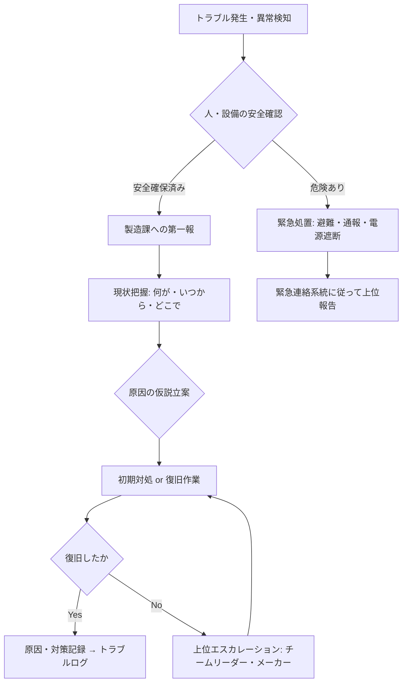

# トラブル初動対応フロー

設備・計装トラブル発生時の初動対応フローです。  
「何が起きているか」を素早く把握し、安全を確保したうえで復旧に向けた判断を行います。

---

!!! danger "最優先事項：安全確保"
    どんなトラブルでも、まず**人の安全**を確保する。  
    設備は後回し。人命・怪我・火災・漏洩の危険を排除することが最優先。

---

## 初動対応フロー



---

## STEP 1：安全確認（最初の30秒）

1. **人の安全を確認する**
    - 負傷者がいる場合：119番通報・AED手配・救護
    - 火災・爆発・漏洩の危険がある場合：その場の全員を避難させてから対応
2. **設備の危険状態を確認する**
    - 煙・火花・異臭・異音が継続している場合：電源遮断を検討
    - 薬液・高温流体の漏洩がある場合：緊急遮断弁の操作を検討

!!! danger "安全確保の判断迷ったら"
    「危ないかも」と思ったら**迷わず遮断・避難**。  
    「大丈夫だった」が最悪ケース。過剰対応でも構わない。

---

## STEP 2：製造課への第一報（最初の2分以内）

設備が停止・異常になったら、まず**製造課（運転員・班長）に報告**する。

### 報告の5W1H

| 項目 | 例 |
|------|-----|
| **いつ** | 〇時〇分頃 |
| **どこで** | ○○号機、○○棟△△エリア |
| **何が** | インバータトリップ、計装信号異常、遮断器遮断 等 |
| **どんな状態** | 設備停止・生産影響あり/なし |
| **いまの対応** | 状況確認中 / 復旧作業着手 |

!!! info "「わからない」も報告する"
    原因不明の段階でも「現在調査中」と伝えることが重要。  
    製造課は生産対応（他ラインへの切り替え等）を判断するために情報を必要としている。

---

## STEP 3：現状把握（最初の5〜10分）

復旧作業に入る前に**現状を正確に把握**する。焦って作業を始めない。

### 確認項目

1. **アラーム・エラーコード確認**
    - DCSのアラームリストで直近のアラーム発生順を確認
    - インバータ・PLC のエラーコードを記録する（エラーコードをメモする前にリセットしない）
2. **現場確認**
    - 設備の外観（焦げ・変形・油漏れ・結露等）
    - ランプ表示（トリップランプ・アラームランプ）
    - 遮断器の状態（ON/OFF/トリップ）
3. **いつから・きっかけを確認**
    - 製造課に「何をしたとき止まったか」を聞く
    - 前日・当日の作業（点検・清掃・設定変更）を確認
4. **過去の同種トラブルを確認**
    - [トラブル症状逆引き](../06-trouble/index.md) を参照
    - 過去のトラブルログを確認

### 仮説と検証の考え方

```
観察事実 → 最も可能性が高い原因を1〜3個に絞る → 一番確認しやすいものから検証
```

---

## STEP 4：初期対処

### 安全に実施できる初期対処の例

| 事象 | 初期対処 |
|------|---------|
| インバータトリップ | エラーコード記録→原因確認→リセット試行 |
| 計装信号異常（DCS警報） | 現場発信器確認・端子緩み確認 |
| 遮断器トリップ | トリップ原因確認→絶縁測定→問題なければ投入試行 |
| 制御弁不動作 | 空気圧確認・ポジショナ確認 |
| 通信異常（PLC/DCS） | 通信ケーブル確認・電源再投入 |

!!! warning "やってはいけないこと"
    - 原因不明のままリセットを繰り返す（再トリップで機器損傷悪化）
    - 異音・異臭が続いている状態で無理に電源投入
    - 遮断器を手で強制投入（スプリングチャージ未確認は危険）
    - 製造課への連絡なしに復旧操作をする

---

## STEP 5：エスカレーション判断

以下の場合は**即座にチームリーダーに報告**する：

- [ ] 30分以内に原因特定ができない
- [ ] 原因はわかったが復旧に特殊スキル・機材が必要
- [ ] 安全上のリスクがある（感電・爆発・漏洩）
- [ ] 生産への影響が長時間になる見込み
- [ ] 機器の損傷が疑われる（交換が必要な可能性）
- [ ] メーカーへの連絡が必要な可能性

### エスカレーション時の報告内容

1. 発生時刻・場所・設備名
2. 現状（エラーコード・アラーム内容）
3. 実施した確認・対処内容
4. 現時点での仮説（原因の推測）
5. 生産への影響（停止時間の見込み）

---

## STEP 6：復旧後の記録

復旧が完了したら必ず**記録を残す**。同じトラブルを繰り返さないために。

### 記録項目

| 項目 | 内容 |
|------|------|
| 発生日時 | YYYY-MM-DD HH:MM |
| 復旧日時 | YYYY-MM-DD HH:MM（停止時間） |
| 設備名・タグ番号 | 具体的に記載 |
| 症状 | DCSアラーム内容・現象の説明 |
| 原因 | 確定した原因（推定の場合は「推定：」と明記） |
| 処置 | 実施した対処内容 |
| 再発防止策 | 定期点検・設定変更・予備品確保 等 |

記録先：`factory/trouble-log.md` または所定のトラブル記録台帳

---

## 緊急連絡系統

!!! info "連絡先は現場の掲示板を確認"
    緊急連絡先（当直・保全課長・消防・救急）は現場に掲示してある連絡先一覧を参照。

| 状況 | 連絡先 |
|------|--------|
| 怪我・火災・漏洩 | 119番 → 保安室 → 上長 |
| 設備トラブル（生産影響大） | 製造課当直 → 電計チームリーダー |
| 電気主任技術者への報告が必要 | 電気主任技術者（法定報告義務確認） |
| メーカーへの緊急問い合わせ | 各機器の保守契約先（予備品管理台帳に記載） |

---

## チェックリスト（初動完了時）

- [ ] 人の安全確認完了
- [ ] 製造課への第一報完了
- [ ] エラーコード・アラーム内容記録済み
- [ ] 現場外観確認完了
- [ ] 仮説立案・検証実施済み
- [ ] エスカレーション要否判断済み
- [ ] 復旧後のトラブル記録完了

---

## 関連ページ

- [トラブル対応の基本](../06-trouble/basics.md)
- [非定常時の判断フレーム](../06-trouble/abnormal-situation.md)
- [電気事故対応と報告](../09-hoantokei/jiko-taiou.md)
- [作業許可証（PTW）発行手順](work-permit.md)
