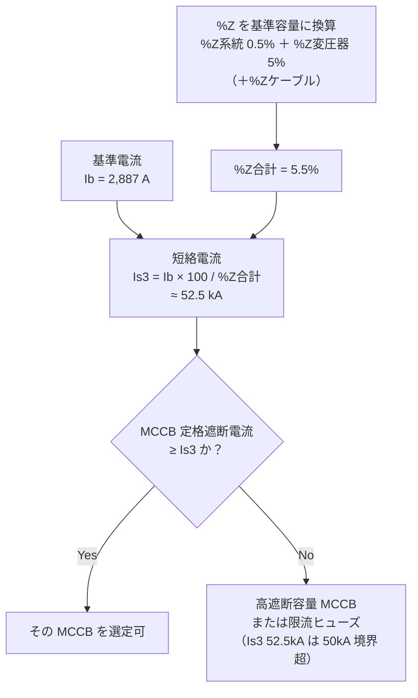

# 計算ツール集

電気計装の現場でよく使う計算式を「式 + 数値例 + 判定基準」の形式でまとめた。

---

## 1. 電圧降下（三相 3 線式）

### 計算式

```
e = √3 × I × (R cosθ + X sinθ) × L

電圧降下率 [%] = e / V0 × 100
```

| 変数 | 単位 | 説明 |
|------|------|------|
| e | V | 線間電圧降下 |
| I | A | 負荷電流 |
| R | Ω/km | 導体抵抗（20℃） |
| X | Ω/km | リアクタンス（0.07〜0.09 が多い） |
| cosθ | — | 力率（電動機は 0.8 が目安） |
| L | km | 片道ケーブル長 |
| V0 | V | 受電端電圧（200V または 400V） |

### 数値例

CV 14sq（R = 1.32 Ω/km、X = 0.083 Ω/km）、I = 30A、cosθ = 0.85、L = 80m

```
sinθ = √(1 - 0.85²) = 0.527

e = 1.732 × 30 × (1.32 × 0.85 + 0.083 × 0.527) × 0.080
  = 1.732 × 30 × 1.166 × 0.080
  = 4.85 V

電圧降下率 = 4.85 / 200 × 100 = 2.4%
```

### 判定基準

- 幹線 2% 以内、分岐 2% 以内、合計 4% 以内（内線規程）

---

## 2. 短絡電流（%インピーダンス法）

### 計算式

```
Is3 = Ib × 100 / %Z合計

Ib = Pb / (√3 × Vb)  [A]  ← 基準電流

%Z合計 = %Z系統 + %Z変圧器 + %Zケーブル（各々を基準容量に換算）
```

### 数値例

変圧器 1,000kVA、%Z = 5%、系統 %Z = 0.5%（1,000kVA 基準）、Vb = 200V

```
Ib = 1,000,000 / (1.732 × 200) = 2,887 A

%Z合計 = 5.0 + 0.5 = 5.5%

Is3 = 2,887 × 100 / 5.5 = 52,490 A ≈ 52.5 kA
```



*%Z を直列に合算して基準電流から短絡電流 Is3 を求め、MCCB の定格遮断電流と比較する。Is3 52.5kA は 50kA を超えるため高遮断容量側へ進む。*

### 判定基準

- MCCB の定格遮断電流 ≥ Is3 であること
- 変圧器直近では 50kA 超になるため高遮断容量 MCCB または限流ヒューズを選定

---

## 3. Cv 値（制御弁の液体流量計算）

### 計算式

```
Cv = Q / √(ΔP / SG)

Q   : 流量 [m³/h]（または US gal/min）
ΔP  : 差圧 [kgf/cm²]（弁前後の圧力差）
SG  : 比重（水 = 1.0）
```

### 数値例

流量 10 m³/h、ΔP = 1.0 kgf/cm²、SG = 1.0（水）

```
Cv = 10 / √(1.0 / 1.0) = 10 / 1.0 = 10.0
```

制御弁の選定時は Cv の計算値の 1.3〜1.5 倍の定格 Cv を持つバルブを選ぶ（50〜80% 開度で運転するため）。

### 判定基準

- 通常運転点での弁開度：50〜80% が適切
- 最小流量時の開度が 10% 以下になる場合はサイジングを見直す

---

## 4. 変圧器容量

### 計算式

```
必要変圧器容量 [kVA] = 合成最大需要電力 [kW] / 総合力率

最大需要電力合計 = Σ(各設備容量 × 各需要率)
合成最大需要電力 = 最大需要電力合計 / 不等率
```

### 数値例

動力 150kW（需要率 0.65）+ 照明 10kW（需要率 0.90）+ 計装 5kW（需要率 0.85）

```
最大需要電力合計 = 150 × 0.65 + 10 × 0.90 + 5 × 0.85
               = 97.5 + 9.0 + 4.25 = 110.75 kW

不等率 = 1.1（工場一般目安）
合成最大需要電力 = 110.75 / 1.1 = 100.7 kW

総合力率 = 0.85 と仮定
必要容量 = 100.7 / 0.85 = 118.5 kVA

将来余裕 20% 考慮 → 118.5 × 1.20 = 142 kVA → 150kVA を選定
```

### 判定基準

- 設計負荷が変圧器定格の 70〜80% に収まるよう選定
- 将来拡張を 15〜20% 見込む

---

## 5. 4-20mA ループ負荷抵抗

### 計算式

```
最大ループ抵抗 [Ω] = (電源電圧 [V] - 最低動作電圧 [V]) / 最大出力電流 [A]

最低動作電圧 : 伝送器の最低必要電圧（一般的に 10〜12V DC）
最大出力電流: 20mA（フルスケール時）
```

### 数値例

電源電圧 24V、伝送器の最低動作電圧 12V

```
最大ループ抵抗 = (24 - 12) / 0.020 = 600 Ω

ループ内に並ぶ抵抗（受信抵抗 + 配線抵抗 + バリア抵抗）の合計が 600Ω 以下であること。

例: 受信抵抗（DCS 入力）250Ω + 配線抵抗 50Ω + 安全バリア 300Ω = 600Ω → ギリギリOK
```

<svg viewBox="0 0 720 260" role="img" aria-label="4-20mAループの直列抵抗構成。電源24Vから伝送器、安全バリア300Ω、配線50Ω、DCS受信抵抗250Ωを直列に接続し、合計600Ωが最大ループ抵抗600Ω以下であることを示す" style="max-width:100%;height:auto;" fill="none" stroke="currentColor" stroke-width="1.5">
  <!-- 電源 -->
  <rect x="20" y="90" width="90" height="50" rx="4"/>
  <text x="65" y="112" text-anchor="middle" font-size="13" stroke="none" fill="currentColor">電源</text>
  <text x="65" y="130" text-anchor="middle" font-size="13" stroke="none" fill="currentColor">24V DC</text>
  <!-- 伝送器 -->
  <rect x="160" y="90" width="90" height="50" rx="4"/>
  <text x="205" y="120" text-anchor="middle" font-size="13" stroke="none" fill="currentColor">伝送器</text>
  <!-- 安全バリア -->
  <rect x="300" y="90" width="90" height="50" rx="4"/>
  <text x="345" y="112" text-anchor="middle" font-size="12" stroke="none" fill="currentColor">安全バリア</text>
  <text x="345" y="130" text-anchor="middle" font-size="13" stroke="none" fill="currentColor">300Ω</text>
  <!-- 配線 -->
  <rect x="440" y="90" width="90" height="50" rx="4"/>
  <text x="485" y="112" text-anchor="middle" font-size="13" stroke="none" fill="currentColor">配線</text>
  <text x="485" y="130" text-anchor="middle" font-size="13" stroke="none" fill="currentColor">50Ω</text>
  <!-- 受信抵抗 -->
  <rect x="580" y="90" width="110" height="50" rx="4"/>
  <text x="635" y="112" text-anchor="middle" font-size="12" stroke="none" fill="currentColor">DCS受信抵抗</text>
  <text x="635" y="130" text-anchor="middle" font-size="13" stroke="none" fill="currentColor">250Ω</text>
  <!-- 直列接続線 -->
  <line x1="110" y1="115" x2="160" y2="115"/>
  <line x1="250" y1="115" x2="300" y2="115"/>
  <line x1="390" y1="115" x2="440" y2="115"/>
  <line x1="530" y1="115" x2="580" y2="115"/>
  <!-- 電流の向きラベル -->
  <text x="360" y="70" text-anchor="middle" font-size="12" stroke="none" fill="currentColor">ループ電流（最大 20mA）が直列に流れる</text>
  <!-- 合算範囲ブラケット -->
  <line x1="300" y1="180" x2="690" y2="180"/>
  <line x1="300" y1="180" x2="300" y2="150"/>
  <line x1="690" y1="180" x2="690" y2="150"/>
  <text x="495" y="205" text-anchor="middle" font-size="13" stroke="none" fill="currentColor">負荷抵抗の合計 = 300 + 50 + 250 = 600Ω</text>
  <text x="495" y="228" text-anchor="middle" font-size="13" stroke="none" fill="currentColor">合計 ≤ 最大ループ抵抗 600Ω であること</text>
</svg>

*電源→伝送器→安全バリア→配線→DCS受信抵抗が直列に並び、負荷抵抗の合計（300 + 50 + 250 = 600Ω）が最大ループ抵抗 600Ω を超えないかを見る。*

### 判定基準

- 合計ループ抵抗 ≤ 最大ループ抵抗
- HART 通信を使用する場合は受信抵抗を 250Ω 以上にする（HART 最低受信抵抗）

---

## 6. コンデンサ容量（力率改善）

### 計算式

```
必要コンデンサ容量 [kvar] = P × (tanθ₁ - tanθ₂)

P     : 有効電力 [kW]
tanθ₁ : 改善前の力率 cosθ₁ から求める tanθ₁ = √(1/cos²θ₁ - 1)
tanθ₂ : 改善後の目標力率 cosθ₂ から求める tanθ₂ = √(1/cos²θ₂ - 1)
```

### 数値例

有効電力 100kW、現在の力率 0.7 → 目標力率 0.95

```
tanθ₁ = √(1/0.7² - 1) = √(1/0.49 - 1) = √(1.04) = 1.020
tanθ₂ = √(1/0.95² - 1) = √(1/0.9025 - 1) = √(0.108) = 0.329

必要コンデンサ容量 = 100 × (1.020 - 0.329) = 69.1 kvar → 70kvar を選定
```

### 判定基準

- 目標力率：0.95 以上（電力会社の力率割引を受けるため）
- 高調波が大きい場合（インバータ多用）はコンデンサへの流入を確認。リアクトル付きコンデンサを使用する
