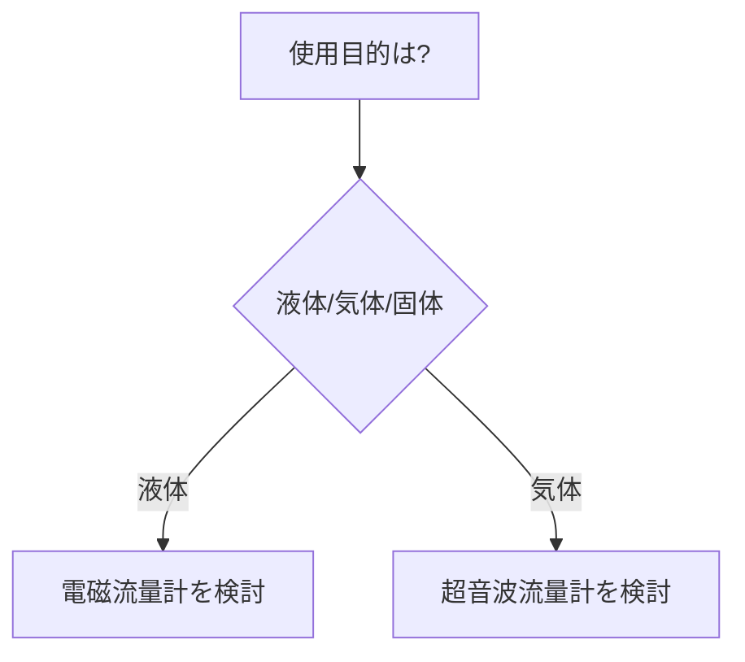

# [テーマ名]

**対象読者**: :material-account-hard-hat: 電気担当 / :material-account: 製造担当

---

## 概要（30秒まとめ）

> [最重要ポイントを3行以内で。専門知識なしで読める文章にする]

## 基本知識

### 定義

[用語の定義・説明]

### 種類・分類

| 種別 | 特徴 | 用途 |
|------|------|------|
| [種別1] | [特徴] | [用途] |
| [種別2] | [特徴] | [用途] |

## 選定ガイド

## 仕様・規格値

| 項目 | 値 | 備考 |
|------|-----|------|
| [規格項目1] | [値] | [出典] |

## 計算方法

$$
[数式があれば記載]
$$

## 実務ポイント

!!! tip "現場での使い方"
    [教科書には書いていない実務的なポイント]

## よくある誤解

- **誤**: [よくある誤解]
  **正**: [正しい理解]

## 関連規格

- [JIS/IEC/電技など]

## 関連記事

- [関連記事](../path/to/article.md)
